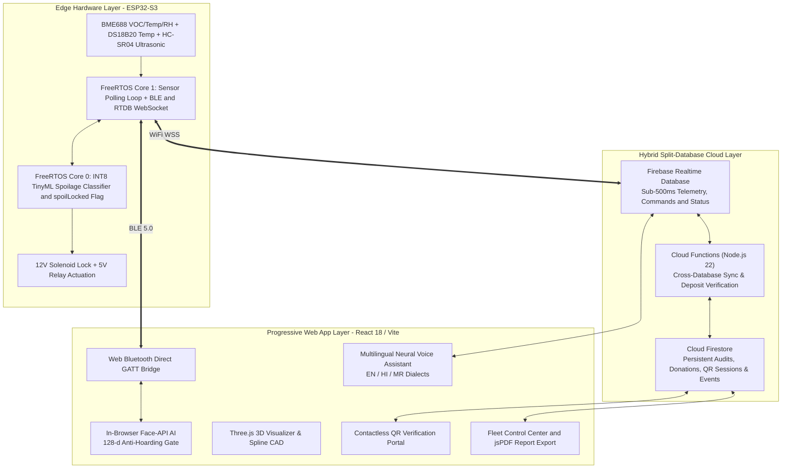

# SAFE: Smart Automated Food Exchange
### Autonomous Food Spoilage Monitoring, Biometric Accountability & Fail-Secure Hardware Actuation

[](./LICENSE)
[](https://vitejs.dev/)
[](https://reactjs.org/)
[](https://tailwindcss.com/)
[](https://firebase.google.com/)
[](https://www.espressif.com/)
[](https://www.tensorflow.org/lite/microcontrollers)
[](https://asep-10fe3.web.app/)

---

## 🌟 Executive Summary

**SAFE (Sustainable Accessible Food Ecosystem)** — also designated as the **Smart Automated Food Exchange (ASEP 2.0)** — is an intelligent, sensor-fused smart food locker infrastructure designed to eliminate food waste while preventing microbial foodborne illnesses.

### Core System Pillars:
1. **Edge TinyML Inference**: Dual-model INT8 neural networks running on an **ESP32-S3** evaluating Volatile Organic Compounds (VOCs) via the **Bosch BME688** and food surface temperature via the **Dallas DS18B20** in under $50\text{ms}$.
2. **Hardware-Enforced Fail-Secure Actuation**: A firmware-level `spoilLocked` boolean flag that physically cuts power to 12V solenoid lock relays when spoilage is detected, making the chamber immune to software or cloud bypass.
3. **Decentralized In-Browser Biometric Verification**: Client-side **Face-API** running on WebGL/WASM extracting anonymous 128-dimensional facial descriptors to enforce community anti-hoarding limits ($\le 2$ meals/person/day).
4. **Mobile QR Remote Donor Verification**: Donors can scan a dynamic session QR code with their mobile device (`/qr-scan`) to verify their identity and phone via SMS OTP (Fast2SMS) remotely without touching public kiosk inputs.
5. **Interactive System Tour**: Built-in 8-step guided interactive walkthrough (`WebsiteTour`) highlighting telemetry status, chambers, biometric guards, and accessibility tools.
6. **Autonomous Ultrasonic Ghost-Donation Defense**: **HC-SR04** ultrasonic depth profiling that triggers a localized acoustic alarm and revokes cloud records if an empty compartment is closed.
7. **Interactive 3D CAD & Digital Twin**: High-fidelity 3D models created in Spline 3D paired with real-time Three.js WebGL digital twin rendering.
8. **Progressive Web Application (PWA)**: Offline-first React 18 / TypeScript application with AI Food Health Advisor, multilingual neural voice assistant (EN/HI/MR), and real-time geospatial fleet management (Leaflet).

---

## 🌐 Live Deployment & Application Routes

* **Production URL**: [https://asep-10fe3.web.app/](https://asep-10fe3.web.app/)

| Route | View | Description |
| :--- | :--- | :--- |
| `/` | **Mode Select** | Kiosk launcher: Donor Mode, Receiver Dashboard, Interactive Tour, 3D Digital Twin |
| `/donate` | **Donor Registration** | Food metadata cataloging, dietary tags, and dual OTP / Mobile QR verification |
| `/receive` | **Kiosk Receiver** | Live chamber grid, QI spoilage gauges, face-biometric anti-hoarding retrieval |
| `/qr-scan` | **Mobile QR Session** | Donor phone portal for contactless identity and OTP verification |
| `/visualizer` | **3D Digital Twin** | Interactive WebGL/Three.js spatial locker visualization and telemetry overlay |
| `/admin` | **Fleet Command V2** | Geospatial fleet map (Leaflet), sensor diagnostics, audit logs, and PDF export |
| `/admin/sign-in` | **Admin Authentication** | Secure role-based administrative credentials portal |
| `/connect` | **BLE Pairing** | Web Bluetooth direct GATT pairing with ESP32 hardware |

---

## 🎨 3D Interactive Spline CAD & Digital Twin Models

* 🧊 **[Interactive Whole Smart Fridge Model (Spline 3D)](https://app.spline.design/file/142d9f0c-1287-4696-9b02-ae598b5f2d1d)** — Multi-compartment smart exchange locker with transparent front panels, display chassis, and sensor modules.
* 📦 **[Interactive Single Sample Chamber Model (Spline 3D)](https://app.spline.design/file/e1997a5b-dccc-4942-9d66-b7ba6503e9d9)** — Modular single locker unit showcasing BME688/DS18B20 sensor mounts, ultrasonic transceivers, and solenoid latch positioning.

---

## 📚 Complete Technical Documentation Suite

Located in the [`docs/`](./docs) directory:

| Document | Link | Highlights |
| :--- | :--- | :--- |
| **01. Concept & Science** | [**`01_IDEA_CONCEPT_AND_PROJECT_DETAILS.md`**](./docs/01_IDEA_CONCEPT_AND_PROJECT_DETAILS.md) | Problem Statement, Failure Modes of Traditional Fridges, VOC/MOS Physics, Prior Art & Technical Innovation Claims. |
| **02. System Architecture** | [**`02_SYSTEM_ARCHITECTURE.md`**](./docs/02_SYSTEM_ARCHITECTURE.md) | Layer 1 Hardware (ESP32-S3, BME688, DS18B20), Layer 2 FreeRTOS Dual-Core AMP Engine, Layer 3 Hybrid Split-Database (RTDB/Firestore), Layer 4 PWA Framework. |
| **03. User Flows** | [**`03_USER_FLOW.md`**](./docs/03_USER_FLOW.md) | Personas, Master Mermaid Flowcharts, Micro-Flows: Pairing, Deposit, Ghost Defense, Spoilage Lockdown, Anti-Hoarding Retrieval, and Admin Control Center. |
| **04. Accuracy & Matrices** | [**`04_ACCURACY_AND_MATRIX_REPORT.md`**](./docs/04_ACCURACY_AND_MATRIX_REPORT.md) | Sensor Calibration Tolerances, TinyML 3-Class Confusion Matrix (96.8% Accuracy), Shelf-Life Regressor (MAE 0.42 hrs), Face-ID Matrix, Latency Budget & 720-hr MTBF. |
| **05. Judge Demo Playbook** | [**`05_JUDGE_DEMO_GUIDE_AND_PRECAUTIONS.md`**](./docs/05_JUDGE_DEMO_GUIDE_AND_PRECAUTIONS.md) | Pre-Demo Checklist, 5-Minute "Winning Walkthrough" Spoken Script, Ghost-Deposit Showstopper Test, Live Fixes, and Top 10 Judge Q&As. |
| **Fullstack Architecture** | [**`docs/SAFE_Locker_Fullstack_Documentation.md`**](./docs/SAFE_Locker_Fullstack_Documentation.md) | Split-database data model, Cloud Functions on Node.js 22, and QR verification session schemas. |
| **Visual Architecture** | [**`docs/SAFE_Locker_Visual_Guide.md`**](./docs/SAFE_Locker_Visual_Guide.md) | Complete sequence diagrams, state machines, and system interaction flows. |

---

## ⚡ High-Level System Architecture



---

## 🛠️ Hardware Pinout & Wiring Schedule

```
  ┌────────────────────────────────────────────────────────────────────────┐
  │                        ESP32-S3 PIN ASSIGNMENTS                        │
  ├───────────────────┬──────────────┬─────────────┬───────────────────────┤
  │ COMPONENT         │ PIN FUNCTION │ ESP32 GPIO  │ PROTOCOL / NOTES      │
  ├───────────────────┼──────────────┼─────────────┼───────────────────────┤
  │ Bosch BME688      │ SDA          │ GPIO 8      │ I2C Data (3.3V Rail)  │
  │ Bosch BME688      │ SCL          │ GPIO 9      │ I2C Clock (3.3V Rail) │
  │ Dallas DS18B20    │ DATA         │ GPIO 4      │ 1-Wire (4.7k Pullup)  │
  │ HC-SR04 Ultrasonic│ TRIG         │ GPIO 6      │ 3.3V Output Pulse     │
  │ HC-SR04 Ultrasonic│ ECHO         │ GPIO 7      │ Via 10k/20k Divider   │
  │ 12V Solenoid Relay│ IN1          │ GPIO 12     │ Active HIGH (Unlock)  │
  │ Acoustic Buzzer   │ POS          │ GPIO 14     │ 880 Hz PWM Alarm      │
  └───────────────────┴──────────────┴─────────────┴───────────────────────┘
```

---

## 📁 Repository Structure

```
ASEP2-PWA-2.0/
├── docs/                                    # 5-part engineering & evaluation suite
│   ├── 01_IDEA_CONCEPT_AND_PROJECT_DETAILS.md
│   ├── 02_SYSTEM_ARCHITECTURE.md
│   ├── 03_USER_FLOW.md
│   ├── 04_ACCURACY_AND_MATRIX_REPORT.md
│   ├── 05_JUDGE_DEMO_GUIDE_AND_PRECAUTIONS.md
│   ├── Front Flow.md
│   ├── SAFE_Locker_Fullstack_Documentation.md
│   └── SAFE_Locker_Visual_Guide.md
├── firmware/                                # ESP32-S3 bare-metal C++ firmware v3.2
│   └── SAFE_Locker_Firmware.ino
├── functions/                               # Cloud Functions (Firebase Node.js 22)
│   └── src/index.ts                         # Deposit, audit, and admin claim handlers
├── public/                                  # Static assets, Web App Manifest & 3D models
│   ├── models/asep_2_revised.glb            # Three.js 3D CAD physical locker model
│   └── manifest.webmanifest
├── src/
│   ├── components/                          # Modular Domain Components
│   │   ├── controls/                        # HelpWidget, LanguageSwitcher, SceneEmbed, StatusPill
│   │   ├── effects/                         # CinematicSplash, ScrollProgress, TextReveal
│   │   ├── feedback/                        # NotificationPanel, OfflineBanner, ToastCenter
│   │   ├── food/                            # FoodHeroV2, QualityGauge, FoodHealthCardPremium
│   │   ├── navigation/                      # AppShell, RouteTransitionV2
│   │   ├── safety/                          # MetricCardPremium, SafetyCapacityCard
│   │   ├── tour/                            # WebsiteTour, TourPromptModal, tourConfig
│   │   └── ui/                              # Radix & Tailwind UI primitives
│   ├── features/                            # Domain Feature Modules
│   │   ├── biometrics/                      # AppleFaceIDScanner, FaceVerificationModal
│   │   ├── calendar/                        # ActiveCommunityCalendar
│   │   ├── locker/                          # useLockerController (BLE & Hardware Hook)
│   │   ├── map/                             # FleetMap (Leaflet)
│   │   ├── telemetry/                       # TelemetryChart (Chart.js)
│   │   ├── verification/                    # QrDonorVerifier, InlineOtpVerifier
│   │   └── voice/                           # VoiceAssistant (SpeechRecognition / Synthesis)
│   ├── routes/                              # Application Route Pages
│   │   ├── ModeSelectPage.tsx               # Main Launchpad (/)
│   │   ├── DonorPage.tsx                    # Food Donation Registration (/donate)
│   │   ├── KioskPage.tsx                    # Receiver Kiosk & Chamber Grid (/receive)
│   │   ├── QrScanPage.tsx                   # Mobile QR Verification Portal (/qr-scan)
│   │   ├── VisualizerPage.tsx               # 3D Digital Twin Visualizer (/visualizer)
│   │   ├── AdminPageV2.tsx                  # Fleet Operations Dashboard (/admin)
│   │   ├── SignInPageV2.tsx                 # Admin Authentication (/admin/sign-in)
│   │   └── ConnectPage.tsx                  # Hardware BLE Pairing (/connect)
│   ├── services/                            # BLE, Firebase RTDB/Firestore, QR Sessions, SMS
│   ├── store/                               # AppContext global state, AppProviders
│   ├── styles/                              # Tailwind, kiosk.css, tour.css, enhancements.css
│   └── utils/                               # Safety formulas, PDF generator, mock data
├── firebase.json                            # Firebase Hosting, RTDB, Firestore & Emulator specs
├── firestore.rules                          # Firestore security rules (includes qr_sessions)
├── package.json
└── README.md
```

---

## 🚀 Quick Start & Development Setup

### 1. Progressive Web App (Frontend)
```bash
# Navigate to repository
cd ASEP2-PWA-2.0

# Install dependencies
npm install

# Start local development server (http://localhost:5173/)
npm run dev

# Run TypeScript checks
npm run lint

# Build production bundle & PWA service worker
npm run build

# Deploy to Firebase Hosting
npx firebase-tools deploy --only hosting
```

### 2. Microcontroller Firmware (ESP32-S3)
1. Open [`firmware/SAFE_Locker_Firmware.ino`](./firmware/SAFE_Locker_Firmware.ino) in Arduino IDE or VS Code / PlatformIO.
2. Ensure ESP32 board package $\ge 2.0.14$ is installed.
3. Configure your 2.4 GHz Wi-Fi credentials in lines 31–32.
4. Select **Board: ESP32S3 Dev Module**, **PSRAM: OPI PSRAM**, **Flash: 16MB (QIO)**.
5. Upload firmware and open Serial Monitor at **115200 baud**.

