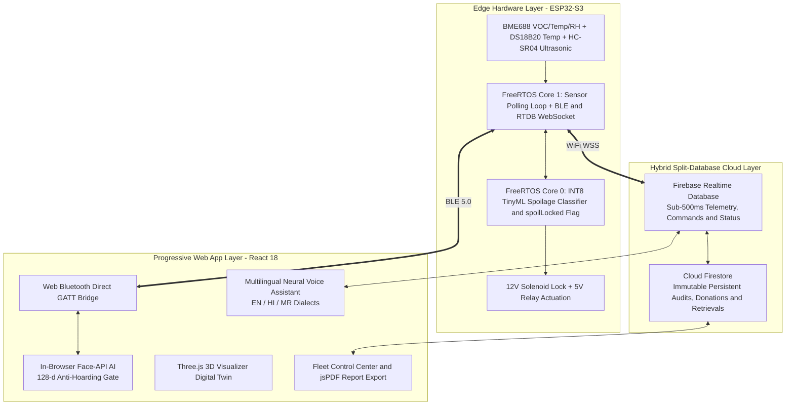

# SAFE: Sustainable Accessible Food Ecosystem
### Autonomous Food Spoilage Monitoring, Biometric Accountability & Fail-Secure Hardware Actuation

[](https://opensource.org/licenses/MIT)
[](https://vitejs.dev/)
[](https://reactjs.org/)
[](https://tailwindcss.com/)
[](https://firebase.google.com/)
[](https://www.espressif.com/)
[](https://www.tensorflow.org/lite/microcontrollers)

---

## 🌟 Executive Summary

**SAFE (Sustainable Accessible Food Ecosystem)** — also designated as the **Smart Automated Food Exchange (ASEP 2.0)** — is an intelligent, sensor-fused smart food locker infrastructure designed to eliminate food waste while preventing microbial foodborne illnesses.

The system combines:
1. **Edge TinyML Inference**: Dual-model INT8 neural networks running on an **ESP32-S3** microcontroller evaluating Volatile Organic Compounds (VOCs) via the **Bosch BME688** and food surface temperature via the **Dallas DS18B20** in under $50\text{ms}$.
2. **Hardware-Enforced Fail-Secure Actuation**: A firmware-level `spoilLocked` boolean flag that physically cuts power to 12V solenoid lock relays when spoilage is detected, making the chamber immune to software or cloud bypass.
3. **Decentralized In-Browser Biometric Verification**: Client-side **Face-API** running on WebGL/WASM to extract anonymous 128-dimensional facial descriptors, enforcing community anti-hoarding limits ($\le 2$ meals/person/day) without expensive kiosk scanners.
4. **Autonomous Ultrasonic Ghost-Donation Defense**: **HC-SR04** ultrasonic depth profiling that triggers a localized acoustic alarm and revokes cloud records if an empty compartment is closed.
5. **Interactive 3D CAD & Digital Twin**: High-fidelity 3D models created in Spline 3D ([Whole Fridge Model](https://app.spline.design/file/142d9f0c-1287-4696-9b02-ae598b5f2d1d) & [Single Sample Chamber](https://app.spline.design/file/e1997a5b-dccc-4942-9d66-b7ba6503e9d9)) paired with real-time Three.js WebGL digital twin rendering.
6. **Progressive Web Application (PWA)**: An offline-first React 18 / TypeScript application with 3D digital twin visualizer (Three.js), multilingual neural voice assistant (EN/HI/MR), and real-time geospatial fleet management (Leaflet).

---


## 🎨 3D Interactive Spline CAD & Digital Twin Models

Explore the physical industrial design and mechanical architecture in interactive 3D:

* 🧊 **[Interactive Whole Smart Fridge Model (Spline 3D)](https://app.spline.design/file/142d9f0c-1287-4696-9b02-ae598b5f2d1d)** — Complete multi-compartment smart exchange locker with transparent front panels, display chassis, and sensor modules.
* 📦 **[Interactive Single Sample Chamber Model (Spline 3D)](https://app.spline.design/file/e1997a5b-dccc-4942-9d66-b7ba6503e9d9)** — Modular single locker unit showcasing the BME688/DS18B20 sensor mounts, ultrasonic transceivers, and solenoid latch positioning.

## 📄 Patent Documentation, CAD Schematics & Vision AI Prompts

The complete set of formal CAD schematics, system architecture diagrams, reference numeral legends, Mermaid diagrams, and Gemini AI prompts for patent submission are available:

- 📘 **[Patent Diagrams & Gemini Prompts Guide](docs/patent/patent_diagrams_and_prompts.md)**
- 📐 **Figure 1 (Circuit & Hardware Schematic)**: [SVG](docs/patent/figures/patent_figure_1_circuit_diagram.svg) | [PNG](docs/patent/figures/patent_figure_1_circuit_diagram.png) | [PDF](docs/patent/figures/patent_figure_1_circuit_diagram.pdf)
- 🏗️ **Figure 2 (Four-Layer System Architecture)**: [SVG](docs/patent/figures/patent_figure_2_system_architecture.svg) | [PNG](docs/patent/figures/patent_figure_2_system_architecture.png) | [PDF](docs/patent/figures/patent_figure_2_system_architecture.pdf)
- 🧠 **Figure 3 (TinyML Preprocessing & Dual-Model Inference Pipeline)**: [SVG](docs/patent/figures/patent_figure_3_tinyml_pipeline.svg)
- 🔒 **Figure 4 (Biometric Consent Gate & Ghost-Donation Flowchart)**: [SVG](docs/patent/figures/patent_figure_4_biometric_ghost_flowchart.svg)
- 🌐 **[Master All-in-One System Vision AI Prompt](docs/patent/patent_diagrams_and_prompts.md#prompt-5-master-all-in-one-system-vision--integrated-architecture)**
- 🐍 **[Python Schematic Generator Script](docs/patent/scripts/generate_patent_diagrams.py)**

---

## 📚 Complete Technical Documentation Suite

The complete engineering, operational, and mathematical documentation is located in the [`docs/`](./docs) folder:

| Document | Link | Summary & Highlights |
| :--- | :--- | :--- |
| **01. Concept & Science** | [**`01_IDEA_CONCEPT_AND_PROJECT_DETAILS.md`**](./docs/01_IDEA_CONCEPT_AND_PROJECT_DETAILS.md) | Problem Statement, Failure Modes of Traditional Fridges, 8 Project Objectives, VOC & MOS Gas Physics, Cross-Sensitivity Formulas, Prior Art Comparison & 4 Patent Claims. |
| **02. System Architecture** | [**`02_SYSTEM_ARCHITECTURE.md`**](./docs/02_SYSTEM_ARCHITECTURE.md) | Layer 1 Hardware (ESP32-S3, BME688, DS18B20, HC-SR04, Relays, Buck Converter), Layer 2 FreeRTOS Dual-Core AMP Engine, Layer 3 Hybrid Split-Database (RTDB vs Firestore), Layer 4 PWA 4-Engine Framework. |
| **03. User Flows** | [**`03_USER_FLOW.md`**](./docs/03_USER_FLOW.md) | Complete Personas, Master Mermaid Flowchart (6 Phases), Step-by-Step Micro-Flows: Pairing, Deposit, Ghost Defense, Spoilage Lockdown, Anti-Hoarding Retrieval, and Admin Control Center. |
| **04. Accuracy & Matrices** | [**`04_ACCURACY_AND_MATRIX_REPORT.md`**](./docs/04_ACCURACY_AND_MATRIX_REPORT.md) | Physical Sensor Calibration Tolerances, TinyML 3-Class Confusion Matrix (96.8% Accuracy, 0.984 ROC-AUC), Shelf-Life Regressor (MAE 0.42 hrs), Face-ID Verification Matrix (98.9% Detect, 0.08% FAR), Latency Budget & 720-hr MTBF. |
| **05. Judge Demo Playbook** | [**`05_JUDGE_DEMO_GUIDE_AND_PRECAUTIONS.md`**](./docs/05_JUDGE_DEMO_GUIDE_AND_PRECAUTIONS.md) | Pre-Demo Checklist (2.4GHz Hotspot, Power rails, Sensor checks), 5-Minute "Winning Walkthrough" Spoken Script, Ghost-Deposit Showstopper Test, 10-Second Live Fixes, and Top 10 Judge Q&As. |

---

## ⚡ High-Level System Architecture



---

## 🛠️ Hardware Pinout & Wiring Schedule

```
  ┌────────────────────────────────────────────────────────────────────────┐
  │                        ESP32-S3 PIN ASSIGNMENTS                        │
  ├───────────────────┬──────────────┬─────────────┬───────────────────────┤
  │ COMPONENT         │ PIN FUNCTION │ ESP32 GPIO  │ PROTOCOL / NOTES      │
  ├───────────────────┼──────────────┼─────────────┼───────────────────────┤
  │ Bosch BME688      │ SDA          │ GPIO 8      │ I2C Data (3.3V Rail)  │
  │ Bosch BME688      │ SCL          │ GPIO 9      │ I2C Clock (3.3V Rail) │
  │ Dallas DS18B20    │ DATA         │ GPIO 4      │ 1-Wire (4.7k Pullup)  │
  │ HC-SR04 Ultrasonic│ TRIG         │ GPIO 6      │ 3.3V Output Pulse     │
  │ HC-SR04 Ultrasonic│ ECHO         │ GPIO 7      │ Via 10k/20k Divider   │
  │ 12V Solenoid Relay│ IN1          │ GPIO 12     │ Active HIGH (Unlock)  │
    │ Acoustic Buzzer   │ POS          │ GPIO 14     │ 880 Hz PWM Alarm      │
  └───────────────────┴──────────────┴─────────────┴───────────────────────┘
```

---

## 🚀 Quick Start & Development Setup

### 1. Progressive Web App (Frontend)
```bash
# Navigate to the PWA repository root
cd ASEP2-PWA-2.0

# Install dependencies
npm install

# Start local development server
npm run dev

# Build production PWA package
npm run build
```

### 2. Microcontroller Firmware (ESP32-S3)
1. Open [`firmware/SAFE_Locker_Firmware.ino`](./firmware/SAFE_Locker_Firmware.ino) in Arduino IDE or VS Code / PlatformIO.
2. Ensure ESP32 board package $\ge 2.0.14$ is installed.
3. Configure your 2.4 GHz Wi-Fi credentials in lines 28–29:
   ```cpp
   #define WIFI_SSID     "YOUR_HOTSPOT_NAME"
   #define WIFI_PASSWORD "YOUR_HOTSPOT_PASSWORD"
   ```
4. Select **Board: ESP32S3 Dev Module**, **PSRAM: OPI PSRAM**, **Flash: 16MB (QIO)**.
5. Upload firmware and open Serial Monitor at **115200 baud**.

---

## 📁 Repository Structure

```
ASEP2-PWA-2.0/
├── docs/                                    # Complete 5-part engineering & evaluation suite
│   ├── 01_IDEA_CONCEPT_AND_PROJECT_DETAILS.md
│   ├── 02_SYSTEM_ARCHITECTURE.md
│   ├── 03_USER_FLOW.md
│   ├── 04_ACCURACY_AND_MATRIX_REPORT.md
│   ├── 05_JUDGE_DEMO_GUIDE_AND_PRECAUTIONS.md
│   └── patent/                              # Formal patent schematics, figures & Python generator
│       ├── figures/
│       │   ├── patent_figure_1_circuit_diagram.pdf / .png / .svg
│       │   ├── patent_figure_2_system_architecture.pdf / .png / .svg
│       │   ├── patent_figure_3_tinyml_pipeline.svg
│       │   └── patent_figure_4_biometric_ghost_flowchart.svg
│       ├── patent_diagrams_and_prompts.md
│       └── scripts/generate_patent_diagrams.py
├── firmware/                                # Latest ESP32-S3 bare-metal C++ firmware
│   └── SAFE_Locker_Firmware.ino
├── public/                                  # Static assets, Web App Manifest & 3D models
│   ├── models/asep_2_revised.glb            # Three.js 3D CAD physical locker model
│   └── manifest.webmanifest
├── src/
│   ├── components/                          # UI components (Face-ID, Gauges, FleetMap, 3D Visualizer)
│   ├── features/                            # useLockerController, useBiometrics hooks
│   ├── routes/                              # Landing, Connect, Donate, Receive (Kiosk), Admin
│   ├── services/                            # BLE, Firebase RTDB, Firestore, Offline Sync
│   ├── store/                               # AppContext global state, i18n translations
│   └── utils/                               # Safety algorithms, formatters, PDF generator
├── package.json
└── README.md
```

---

## 👥 Academic & Patent Credits

* **Patent Applicants**: Vishwakarma Institute of Technology (VIT), Pune, Maharashtra, India
* **Faculty Mentors**: Prof. Dr. Anil Kadu, Prof. Dr. Amruta Patil
* **Inventors & Student Researchers**:
  - Sanskar Dnyaneshwar Dhonde
  - Sara Salim Tamboli
  - Gandharv Mahesh Sapthashwa
  - Sarah Dighvijay Narsay
  - M. Arsh Sarakwas
