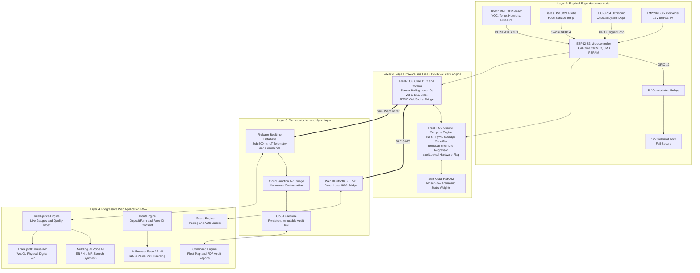
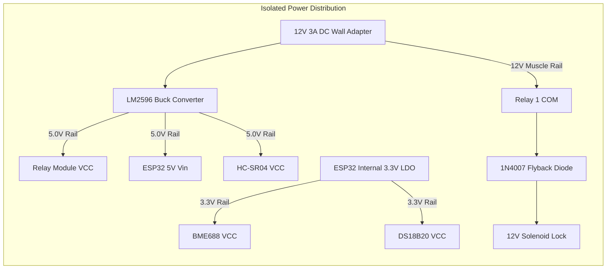
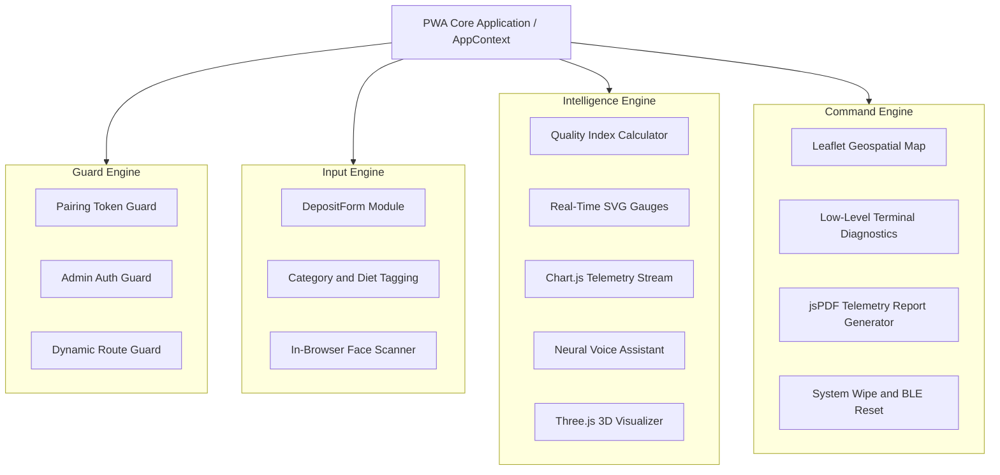

# SAFE: System Architecture Specification
## Comprehensive Edge-to-Cloud Hardware, Firmware & Software Engineering Architecture

---

## 1. Architectural Overview & Design Philosophy

The **SAFE (Sustainable Accessible Food Ecosystem)** system is built upon a **Decoupled, Edge-First, and Local-First Hybrid Architecture**. The architecture ensures zero-latency biological safety decisions, continuous offline operation during internet outages, decentralized biometric user accountability, and real-time cloud fleet telemetry.



---

## 2. Layer 1: Hardware Layer & Circuit Engineering

### 2.1 Microcontroller Architecture: ESP32-S3 (N16R8)
The core compute node is an **Espressif ESP32-S3-WROOM-1** microcontroller:
* **CPU**: Dual-Core 32-bit Xtensa LX7 running at $240\text{ MHz}$.
* **Vector Extensions**: Integrated vector instructions (ESP-NN SIMD acceleration) designed specifically for neural network matrix multiplications.
* **Internal SRAM**: $512\text{ KB}$ SRAM.
* **External PSRAM**: $8\text{ MB}$ Octal SPI PSRAM (used to house TensorFlow Lite tensor arenas and prevent memory panics).
* **Flash Memory**: $16\text{ MB}$ Quad SPI Flash.
* **Wireless Protocols**: $2.4\text{ GHz}$ Wi-Fi ($802.11\text{ b/g/n}$) and Bluetooth 5.0 (LE + Mesh).

### 2.2 Complete Hardware Pinout & Wiring Schedule

| Component | Pin Function | ESP32-S3 GPIO | Operating Voltage | Communication Protocol / Logic Level |
| :--- | :--- | :--- | :--- | :--- |
| **Bosch BME688** | VCC | 3.3V Pin | 3.3V DC | Power supply (Low noise rail) |
| **Bosch BME688** | GND | GND | 0V | Common ground plane |
| **Bosch BME688** | SDA | **GPIO 8** | 3.3V Logic | I2C Data line ($4.7\text{k}\Omega$ internal pull-up) |
| **Bosch BME688** | SCL | **GPIO 9** | 3.3V Logic | I2C Clock line ($4.7\text{k}\Omega$ internal pull-up) |
| **Dallas DS18B20** | VCC | 3.3V Pin | 3.3V DC | Power supply |
| **Dallas DS18B20** | GND | GND | 0V | Common ground plane |
| **Dallas DS18B20** | DATA | **GPIO 4** | 3.3V Logic | One-Wire Bus ($4.7\text{k}\Omega$ external pull-up to 3.3V) |
| **HC-SR04 Ultrasonic**| VCC | 5V Rail | 5.0V DC | Power supply |
| **HC-SR04 Ultrasonic**| GND | GND | 0V | Common ground plane |
| **HC-SR04 Ultrasonic**| TRIG | **GPIO 5** | 3.3V Logic | Output trigger pulse ($10\mu\text{s}$) |
| **HC-SR04 Ultrasonic**| ECHO | **GPIO 6** | 3.3V Logic | Input echo pulse (via $1\text{k}\Omega/2\text{k}\Omega$ voltage divider) |
| **Optoisolated Relay 1**| IN1 | **GPIO 12** | 5V Logic | Active LOW trigger (controls 12V Solenoid Lock) |
| **Relay Module VCC** | VCC | 5V Rail | 5.0V DC | Optocoupler supply |
| **Buzzer / Alarm** | POS | **GPIO 14** | 3.3V/5V | PWM acoustic alarm output ($880\text{ Hz}$) |



### 2.3 Electrical Isolation & Flyback Protection
* **Voltage Isolation**: The circuit strictly isolates the $12\text{V}$ high-current inductive load ("muscle rail") from the sensitive $3.3\text{V}$ sensor rail to prevent microcontroller brownouts, latch-ups, or resets during solenoid energization.
* **Flyback Diode Protection**: An ultra-fast **1N4007 diode** is wired in reverse-parallel across the solenoid terminals. When the relay disengages, the collapsing magnetic field creates a reverse inductive voltage spike ($V = -L \frac{di}{dt}$ up to $> 100\text{V}$). The flyback diode safely clamps this spike to $0.7\text{V}$, dissipating energy through the solenoid coil.
* **Common Ground Plane**: All grounds (12V PSU ground, 5V buck converter ground, and ESP32 3.3V ground) are tied together at a single star-ground point to prevent ground loops.

---

## 3. Layer 2: Edge Firmware & FreeRTOS Dual-Core Processing

### 3.1 Asymmetric Multiprocessing (AMP) Task Allocation
The ESP32-S3 runs FreeRTOS with strict core pinning to prevent sensor polling or Wi-Fi network latency from blocking safety-critical TinyML inference:

```
  ┌────────────────────────────────────────┐  ┌────────────────────────────────────────┐
  │         FreeRTOS CORE 0 (COMPUTE)      │  │        FreeRTOS CORE 1 (I/O & COMMS)   │
  │                                        │  │                                        │
  │  • INT8 TensorFlow Lite Micro Runtime  │  │  • I2C Polling: BME688 (10s interval)  │
  │  • Spoilage Classifier (MLP Model)     │  │  • 1-Wire Polling: DS18B20 Probe       │
  │  • Residual Shelf-Life Regressor       │  │  • Ultrasonic Depth Echo Task (HC-SR04)│
  │  • Humidity Cross-Sensitivity Comp.    │  │  • Firebase RTDB WebSocket Client      │
  │  • Hardware-Enforced spoilLocked Check │  │  • Web Bluetooth (BLE 5.0) Server      │
  │  • Sub-50ms Inference Decision Cycle   │  │  • Solenoid Timed Actuation     │
  └────────────────────────────────────────┘  └────────────────────────────────────────┘
                       ▲                                           ▲
                       └───────────── Inter-Core Queue ────────────┘
                                   (Shared FreeRTOS RingBuffer)
```

### 3.2 Hardware-Enforced Fail-Secure State Machine
The firmware maintains an atomic, memory-protected boolean variable: `volatile bool spoilLocked = false;`.
1. Every 10 seconds, Core 0 executes TinyML inference on latest sensor readings.
2. If the model outputs **Class 2 (DANGER / Spoilage)**:
   - `spoilLocked` is set to `true`.
   - The relay actuation GPIO pin (GPIO 12) is forced to `HIGH` (Relay de-energized = Solenoid physically locked).
   - An audible alert flag is broadcast.
3. If an incoming `UNLOCK` command is received from the PWA or cloud database, the actuation routine evaluates:
   ```cpp
   if (command == "UNLOCK") {
       if (spoilLocked) {
           Serial.println("[SECURITY OVERRIDE] Door UNLOCK blocked: Spoilage Lockdown active.");
           Firebase.RTDB.setString(&fbdo, "/status/" + macAddr + "/error", "SPOILAGE_LOCKDOWN_ACTIVE");
           return; // REJECT ACTUATION
       }
       // Actuate solenoid only if spoilLocked is false
       digitalWrite(RELAY_PIN, LOW); // Energize Solenoid
       delay(5000);
       digitalWrite(RELAY_PIN, HIGH); // Auto-Relock
   }
   ```
4. Only a cryptographically signed `ADMIN_UNLOCK` command issued by an authenticated administrator can clear `spoilLocked`, logging a permanent forensic audit record in Firestore.

---

## 4. Layer 3: Communication & Hybrid Split-Database Sync Layer

SAFE uses a **Split-Database Architecture** to optimize network throughput, battery consumption, and regulatory auditing requirements:

```
                                  SAFE HYBRID CLOUD
                                          │
            ┌─────────────────────────────┴─────────────────────────────┐
            ▼                                                           ▼
  FIREBASE REALTIME DB (RTDB)                                   CLOUD FIRESTORE
  (High-Frequency IoT Streaming)                                (Persistent Immutable Audits)
  ───────────────────────────────                               ─────────────────────────────
  • /telemetry/{lockerId}                                       • /donations (Item metadata)
  • /commands/{lockerId}                                        • /retrievals (Biometric hashes)
  • /status/{lockerId}                                          • /events (Lock/Unlock logs)
  • /devices/{lockerId}                                         • /alerts (Security warnings)
  • Sub-500ms streaming latency                                 • /system_logs (Audit trail)
```

### 4.1 Firebase Realtime Database (RTDB) Schema

```json
{
  "telemetry": {
    "94B5552C8890": {
      "timestamp": 1724678400000,
      "internalTempC": 26.09,
      "externalTempC": 26.19,
      "humidityPct": 77.59,
      "pressureHpa": 934.33,
      "gasResistanceOhms": 239981,
      "distanceCm": 3.6,
      "heaterStep": 2,
      "sensorHealth": "healthy",
      "heuristicGasProfile": ["Live hardware telemetry stream active"]
    }
  },
  "commands": {
    "94B5552C8890": {
      "command": "UNLOCK",
      "issuedAt": 1724678405000,
      "issuedBy": "pwa",
      "acknowledged": true,
      "acknowledgedAt": 1724678406200
    }
  },
  "status": {
    "94B5552C8890": {
      "door_state": "closed",
      "lock_state": "locked",
      "occupancy": "occupied",
      "food_type": "dairy",
      "last_heartbeat": 1724678410000
    }
  }
}
```

### 4.2 Cloud Firestore Database Collections
1. `donations`: Stores complete donation records, including `foodName`, `categoryLabel`, `dietTag`, `donorName`, `donorContact`, `deadlineEstimate`, and `createdAt`.
2. `retrievals`: Stores collection receipts with `retrievedBy` (receiver vs admin_override), `retrievedAt`, `qualityScoreAtRetrieval`, and `faceDescriptor` (128-d vector).
3. `events`: Append-only log of physical door openings, closings, timeouts, and BLE pairing events.
4. `system_logs`: Cryptographically protected audit entries. **Firestore Security Rules completely deny `write` or `update` access from client-side SDKs**, guaranteeing an unforgeable compliance record.

### 4.3 Web Bluetooth (BLE 5.0) Service Architecture
* **Primary Service UUID**: `4fafc201-1fb5-459e-8fcc-c5c9c331914b`
* **Telemetry Characteristic (Notify)**: `beb5483e-36e1-4688-b7f5-ea07361b26a8`
* **Command Characteristic (Write)**: `6e400002-b5a3-f393-e0a9-e50e24dcca9e`
* **Category Tagging Characteristic (Write)**: `a0123456-789a-bcde-f012-3456789abcde`

---

## 5. Layer 4: Progressive Web Application (PWA) Architecture

The frontend is implemented in **React 18 + Vite + TypeScript + Tailwind CSS v4** with a "Cyber-Botanical" design system.



### 5.1 The Four Modular Frontend Engines
1. **Guard Engine**: Enforces application security. If a user launches the app without a valid hardware pairing key in `localStorage`, the Route Guard redirects to `/connect`. Protects `/admin` behind admin authentication.
2. **Input Engine**: Manages donation entry. Captures food name, category, allergens, dietary preferences (`veg`, `non_veg`, `vegan`), and executes the in-browser biometric consent capture.
3. **Intelligence Engine**: Continuously computes the Quality Index (QI), renders animated quality gauges, updates live charts, and drives the **Multilingual Neural Voice Assistant** (English, Hindi, Marathi) with phonetic food terminology expansion.
4. **Command Engine**: Equips administrators with fleet-wide geospatial mapping, unit-level health monitoring, one-click PDF audit report generation, remote BLE bridge resets, and emergency database wipe capabilities.

### 5.2 In-Browser Biometric Face-ID AI Subsystem
The biometric engine executes entirely in the client browser using WebGL and WebAssembly (WASM), eliminating the need for expensive physical kiosk scanners or server-side facial image uploads:
* **Models Loaded**:
  - `TinyFaceDetector`: Rapid, lightweight bounding box locator ($416\times416$ tensor input).
  - `FaceLandmark68Net`: Identifies 68 facial fiducial points (eyes, nose bridge, jawline).
  - `FaceRecognitionNet`: Computes a normalized **128-dimensional floating-point embedding vector** ($\mathbb{R}^{128}$).
* **Multi-Frame Liveness Consistency**: The system verifies that a centered, valid face is present in at least **4 out of 5 consecutive video frames** before accepting an embedding.
* **Anti-Hoarding Matching Algorithm**:
  When a receiver attempts a withdrawal, their live 128-d vector $V_{\text{live}}$ is compared against today's stored retrieval embeddings $\{V_1, V_2, \dots, V_k\}$ using Euclidean distance:
  $$d(V_{\text{live}}, V_{\text{stored}}) = \sqrt{\sum_{i=1}^{128} (V_{\text{live}}[i] - V_{\text{stored}}[i])^2}$$
  - **Match Threshold**: If $d < 0.55$, the individual is recognized as the same person.
  - **Policy Enforcement**: If the match count for the current day $\ge 2$, the retrieval is programmatically denied with an anti-hoarding alert.

---

## 6. End-to-End System Integration Summary

| System Layer | Primary Technologies | Key Functions | Latency / Cycle Time |
| :--- | :--- | :--- | :--- |
| **Physical Hardware** | ESP32-S3, BME688, DS18B20, HC-SR04, 12V Solenoid | Environmental sensing, depth detection, physical locking | $10\text{s}$ telemetry cycle |
| **Edge Firmware** | FreeRTOS, C++, TFLite Micro, ESP-NN, OneWire, Wire | Multiprocessing, TinyML inference, `spoilLocked` enforcement | $< 50\text{ms}$ inference time |
| **Communication** | Web Bluetooth API, WebSockets, REST | Local GATT bridging, sub-second telemetry push | $180\text{ms} - 320\text{ms}$ bridge latency |
| **Cloud Backend** | Firebase RTDB, Cloud Firestore, Cloud Functions | Streaming data sync, persistent logging, security rules | Sub-500ms sync speed |
| **Frontend PWA** | React 18, Vite, TypeScript, Tailwind v4, Framer Motion | User interface, live telemetry, sound alerts, 3D twin | 60 FPS smooth rendering |
| **Client Biometrics** | Face-API.js, WebGL, WebAssembly, HTML5 MediaStream | Face detection, 128-d vectors, anti-hoarding daily check | $42\text{ms}$ vector extraction |

### 5.3 Interactive 3D CAD & Digital Twin Models
The SAFE system features high-fidelity 3D spatial models accessible directly for CAD inspection and within the PWA:
* 🧊 **[Whole Smart Fridge / Locker Array (Spline 3D)](https://app.spline.design/file/142d9f0c-1287-4696-9b02-ae598b5f2d1d)**: Complete multi-chamber locker visualizer with transparent doors, sensor bays, and kiosk chassis.
* 📦 **[Single Sample Chamber (Spline 3D)](https://app.spline.design/file/e1997a5b-dccc-4942-9d66-b7ba6503e9d9)**: Modular single-compartment model detailing internal volume, sensor placements, and latch assembly.
* **Three.js WebGL Digital Twin**: Embedded real-time renderer dynamically reflecting physical locker occupancy and temperature state in the PWA.

### 5.4 Dual-Track Interactive Website Tour Subsystem
To ensure frictionless onboarding for first-time community donors, recipients, and evaluating judges, the PWA implements an interactive, multi-step guided tour engine (`WebsiteTour.tsx` & `tourConfig.ts`):
* **Dual Exploration Paths**:
  - **Donor Track**: Guides the user through chamber selection, live climate readiness checks, food categorization, contactless QR verification, and fail-secure physical lock confirmation.
  - **Receiver Track**: Guides recipients through chamber browsing, Quality Index (QI) freshness interpretation, Face-ID camera alignment, and anti-hoarding retrieval authorization.
* **Dynamic Visual Spotlight**: Uses CSS backdrop-blur and SVG/box-shadow viewport cutouts to isolate and spotlight target DOM elements, automatically scrolling and switching routes as the user advances.
* **Celebratory Gamification**: Concludes with a themed celebratory modal (`TourCompletionModal.tsx`) featuring sound synthesis, community impact metrics, and role-appropriate calls to action.

### 5.5 Contactless Mobile QR Verification & Multi-Tier Client-IP Subsystem
To maintain hygiene and prevent fraud, donors can bypass public touchscreen keyboards using a mobile companion workflow (`QrDonorVerifier.tsx`, `QrScanPage.tsx`, and `qrSessionService.ts`):
* **Dynamic Session QR Tokens**: The kiosk generates a time-bounded cryptographic session identifier in Cloud Firestore (`/qr_sessions/{docId}`) rendered as a high-contrast QR code on the kiosk screen.
* **Mobile Smartphone Camera Flow**: The donor scans the QR code with their mobile device camera, opening `/qr-scan?session={sessionId}` on their phone.
* **Multi-Tier Client-IP Verification Engine**:
  To protect against remote replay attacks and location spoofing, the system determines the client's public IP address using a multi-tier fallback architecture:
  1. **Tier 1 (Internal Vite / Cloudflare Tunnel)**: Queries `/api/client-ip` middleware to extract `cf-connecting-ip`, `x-forwarded-for`, or `x-real-ip`.
  2. **Tier 2 (Parallel Edge Providers)**: In parallel, queries Cloudflare trace (`https://cloudflare.com/cdn-cgi/trace`), Ipify (`https://api64.ipify.org`), and IPWhois.
  3. **Sanitization & Anti-Spoofing**: Strips IPv6-mapped IPv4 prefixes (`::ffff:`) and validates format before saving session metadata to Firestore.
* **Fast2SMS Cellular OTP Integration**: Sends a 6-digit numeric OTP to the donor's mobile number. Once verified on the phone, the kiosk automatically synchronizes via real-time Firestore snapshots and unlocks the assigned chamber.

### 5.6 Multilingual Neural Voice Assistant Subsystem
The voice engine (`VoiceAssistant.tsx`) empowers hands-free accessibility for non-technical users and multiple regional language speakers:
* **Speech-to-Text Recognition**: Employs the HTML5 Web Speech API (`webkitSpeechRecognition`) to continuously transcribe user queries in real-time.
* **Phonetic & Text Normalization**:
  The `cleanTextForSpeech` engine sanitizes markdown, strips technical symbols, and translates application routes and product names into clear, natural phonetics (e.g., expanding `SAFE_01` to *"Safe chamber 1"*, `/donate` to *"donor section"*, and `EcoLocker` to *"Eco Locker"*).
* **Multilingual Natural Synthesis**: Employs the `SpeechSynthesis` API with auto-selected native neural voice profiles for English (`en-US` / `en-IN`), Hindi (`hi-IN`), and Marathi (`mr-IN`).
* **Vocal Route & Telemetry Navigation**: Users can verbally issue queries such as *"What's in Chamber 4?"*, *"Which lockers are empty?"*, or *"I want to donate food"*, automatically driving the PWA navigation state.

---

## 6. End-to-End System Integration Summary

| System Layer | Primary Technologies | Key Functions | Latency / Cycle Time |
| :--- | :--- | :--- | :--- |
| **Physical Hardware** | ESP32-S3, BME688, DS18B20, HC-SR04, 12V Solenoid | Environmental sensing, depth detection, physical locking | $10\text{s}$ telemetry cycle |
| **Edge Firmware** | FreeRTOS, C++, TFLite Micro, ESP-NN, OneWire, Wire | Multiprocessing, TinyML inference, `spoilLocked` enforcement | $< 50\text{ms}$ inference time |
| **Communication** | Web Bluetooth API, WebSockets, REST | Local GATT bridging, sub-second telemetry push | $180\text{ms} - 320\text{ms}$ bridge latency |
| **Cloud Backend** | Firebase RTDB, Cloud Firestore, Cloud Functions | Streaming data sync, persistent logging, security rules | Sub-500ms sync speed |
| **Frontend PWA** | React 18, Vite, TypeScript, Tailwind v4, Framer Motion | User interface, live telemetry, sound alerts, 3D twin | 60 FPS smooth rendering |
| **Client Biometrics & Camera** | Face-API.js, WebGL, WebAssembly, HTML5 MediaStream | Face detection, 128-d vectors, anti-hoarding daily check | $42\text{ms}$ vector extraction |
| **Mobile QR & IP Engine** | HTML Canvas, Cloud Firestore, Cloudflare Trace, Fast2SMS | Contactless mobile scan, Edge IP detection, SMS OTP | $< 1.5\text{s}$ session handshake |
| **Voice Assistant** | Web Speech API, SpeechSynthesis, NLP cleaner | Multilingual vocal queries, route navigation, audio waves | Instantaneous local speech |
