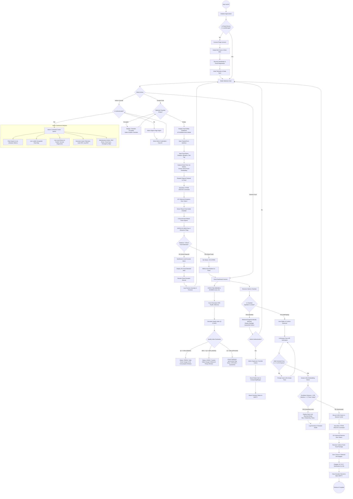

# SAFE: End-to-End User Flow & Micro-Step Operational Specification
## Granular Interaction Workflows, Biometric Protocols, Fail-Secure Logic & State Transitions

---

## 1. System Personas & User Archetypes

The **SAFE** platform serves three distinct user roles, each with tailored UI/UX workflows, permission levels, and security constraints:

```
  ┌─────────────────────────────────────────────────────────────────────────────┐
  │                            SAFE USER PERSONAS                               │
  ├──────────────────────┬──────────────────────┬───────────────────────────────┤
  │   1. SURPLUS DONOR   │   2. FOOD RECEIVER   │    3. FLEET ADMINISTRATOR     │
  │                      │                      │                               │
  │ • Restaurants/Catering│ • University Students│ • Community NGO Coordinators  │
  │ • Dining Hall Staff  │ • Local Citizens     │ • Health & Sanitation Staff   │
  │ • Citizen Donors     │ • Vulnerable Groups  │ • Maintenance Engineers       │
  │                      │                      │                               │
  │ Goals: Fast, hygienic│ Goals: Guaranteed    │ Goals: Real-time telemetry,   │
  │ food deposit (<60s)  │ fresh food, dignified│ audit trails, emergency       │
  │ with donor receipt.  │ access, clear alerts.│ overrides, zero spoilage.     │
  └──────────────────────┴──────────────────────┴───────────────────────────────┘
```

---

## 2. Master Operational Flowchart

The following diagram illustrates every transitional state, decision branch, error loop, and security gate across the entire SAFE lifecycle:



---

## 3. Phase-by-Phase Granular Step Specification

### Phase 1: Device Onboarding & Hardware Pairing (`/connect`)
* **Step 1.1 (Route Guard Verification)**: Upon app startup, `AppContext` verifies whether a paired device identifier (`ecolocker-hardware-mac`) exists in `localStorage`. If absent, the application locks navigation and redirects to `/connect`.
* **Step 1.2 (Transport Selection)**:
  - *Option A (Web Bluetooth)*: The user taps "Connect EcoLocker". The browser triggers `navigator.bluetooth.requestDevice` with the primary SAFE Service UUID (`4fafc201-1fb5-459e-8fcc-c5c9c331914b`).
  - *Option B (Cloud MAC Manual Registration)*: In non-BLE environments or remote terminals, the user enters the 12-character ESP32 MAC address (e.g., `94B5552C8890`).
* **Step 1.3 (Cloud Initialization Handshake)**: The frontend invokes `registerDevice()` in `rtdb.ts`, creating initialized data slots under `/devices/{mac}`, `/telemetry/{mac}`, `/status/{mac}`, and `/commands/{mac}`.
* **Step 1.4 (State Transition)**: Once the security handshake is confirmed, `isPairingComplete` is set to `true`, and the user is automatically navigated to the Mode Selection Hub (`/`).

---

### Phase 2: Donor Registration & Deposit Workflow (`/donate`)
* **Step 2.1 (Chamber Selection & Availability Check)**: The donor selects a target compartment (Chambers 1–8). If `occupancyState !== 'empty'`, the system displays an `Occupied` indicator and prevents form submission.
* **Step 2.2 (Safety Protocol Acknowledgment)**: A modal automatically presents food safety rules:
  - Freshly cooked items must be hot-sealed within safe containers.
  - Raw unpackaged meats and expired dairy products are prohibited.
  - Required labeling of known allergens (nuts, gluten, dairy, soy).
* **Step 2.3 (Metadata Entry)**: The donor enters food name, selects food category (Dairy, Cooked Meat, Fruit, Vegetable, Roti/Bread), specifies dietary tags (`veg`, `non_veg`, `vegan`), and enters donor contact details.
* **Step 2.4 (Biometric Consent Capture)**:
  - The HTML5 camera stream activates.
  - The in-browser `faceapi.detectSingleFace()` localizes the donor's face.
  - A 128-dimensional mathematical descriptor ($\mathbb{R}^{128}$) and base64 security snapshot are captured.
* **Step 2.5 (Actuation & Deposit Cycle)**:
  1. The PWA writes `command: "UNLOCK"` to `/commands/{mac}` in Firebase RTDB and sends a BLE GATT write.
  2. The ESP32 energizes the 12V relay, retracting the solenoid pin for $5.0\text{ seconds}$.
  3. The donor opens the door and places the food container inside.
  4. The door closes, and the solenoid re-locks automatically.
* **Step 2.6 (Autonomous Ghost-Donation Detection Protocol)**:
  1. Once locked, the ESP32 fires $3\times$ ultrasonic pings via the **HC-SR04** sensor.
  2. If the measured distance is equal to the empty chamber depth ($d \approx 32\text{cm}$):
     - **NO FOOD DETECTED**: The ESP32 triggers a pulsing acoustic buzzer alarm ($880\text{ Hz}$).
     - The PWA catches the `empty` status, cancels the pending donation record in Firestore, shows a "No Food Detected — Deposit Cancelled" modal, and logs a security anomaly.
  3. If the measured distance is reduced ($d < 25\text{cm}$):
     - **FOOD CONFIRMED**: The system updates `occupancyState = 'occupied'`, syncs the donation to Firestore, and initiates a **900ms auto-redirect** to the Kiosk Dashboard (`/receive`).

---

### Phase 3: Real-Time Biochemical Monitoring & Spoilage Lockdown
* **Step 3.1 (Continuous Sensor Telemetry Polling)**:
  Every 10 seconds, the ESP32-S3 queries the Bosch BME688 (VOC gas resistance, internal temperature, relative humidity, pressure) and Dallas DS18B20 (food surface temperature).
* **Step 3.2 (Edge TinyML Evaluation)**:
  FreeRTOS Core 0 applies the humidity cross-sensitivity formula and executes the quantized neural network:
  $$\text{Input Vector} = \left[ T_{\text{internal}}, \, T_{\text{surface}}, \, RH, \, R_{\text{compensated}}, \, \text{Category\_ID} \right]$$
* **Step 3.3 (Quality State Evaluation & Actuation Enforcement)**:
  - **FRESH ($QI \ge 60\%$)**: Green status pill, normal countdown window, accessible to all community receivers.
  - **AGING ($30\% \le QI < 60\%$)**: Yellow warning pill, priority pickup notification sent to community redistribution workers.
  - **SPOILED ($QI < 30\%$)**:
    1. Firmware asserts the internal `spoilLocked = true` flag.
    2. Relay GPIO 12 is forcibly locked.
    3. The PWA updates the UI to **SPOILED / QUARANTINE**.
    4. The standard "Slide to Retrieve" button is completely disabled for general users.
    5. The system alerts maintenance personnel with recommendations for anaerobic digestion or agricultural composting.

---

### Phase 4: Receiver Selection & Anti-Hoarding Retrieval Workflow (`/receive`)
* **Step 4.1 (Kiosk Exploration & Safety Inspection)**:
  Receivers view live interactive cards showing food item name, dietary badge, live temperature, VOC health score, and an explicit **Consumption Deadline Countdown Timer**.
* **Step 4.2 (Retrieval Initiation)**:
  The user executes a tactile "Slide to Retrieve" gesture.
* **Step 4.3 (Decentralized Biometric Anti-Hoarding Verification)**:
  1. The Apple Face-ID style scanning modal opens, activating the user-facing camera.
  2. `useBiometrics` tracks facial stability across 5 frames. If $\ge 4$ frames contain a valid, centered face, the 128-d descriptor $V_{\text{receiver}}$ is computed.
  3. The algorithm calculates Euclidean distances against all descriptors recorded in `sessionStorage` today:
     $$\text{Matches} = \sum_{k=1}^{N} \mathbb{I}\left( \|V_{\text{receiver}} - V_k\|_2 < 0.55 \right)$$
  4. **Hoarding Denial Branch**: If $\text{Matches} \ge 2$, the retrieval is aborted. The modal displays: *"Daily Community Limit Reached (2/2 meals collected today). Please return tomorrow."*
  5. **Approval Branch**: If $\text{Matches} < 2$, $V_{\text{receiver}}$ is stored in the local registry, and the unlock transaction proceeds.
* **Step 4.4 (Physical Retrieval & Hygiene Reset)**:
  1. The PWA sends `UNLOCK` to the hardware.
  2. The door unlatches; the receiver takes their food package.
  3. Upon door closure, the ESP32 engages the **12V UV-C germicidal LED strip** for $20\text{ seconds}$ to eliminate bacterial pathogens on chamber walls.
  4. The compartment resets to `EMPTY` and is immediately ready for the next donation.

---

### Phase 5: Administrator Command & Fleet Operations (`/admin`)
* **Step 5.1 (Auth Guard & Sign-In)**: Access to `/admin` requires authenticated credentials via `SignInPageV2`.
* **Step 5.2 (Fleet Map & Geospatial Tracking)**: An interactive Leaflet map displays geographic node status, battery/power health, active chamber occupancy, and localized spoilage alerts across the city.
* **Step 5.3 (Terminal Diagnostics)**: Real-time console logs displaying FreeRTOS memory usage, PSRAM heap availability, BLE RSSI signal strength, and raw BME688 gas curves.
* **Step 5.4 (Instant PDF Audit Generation)**: Using `jspdf` and `jspdf-autotable`, the administrator can generate formal, timestamped compliance reports containing historical temperature traces, VOC logs, and biometric collection receipts.
* **Step 5.5 (Emergency & Maintenance Commands)**:
  - **Admin Override Unlock**: Unlocks a spoiled chamber for cleaning and compost removal.
  - **BLE Bridge Reset**: Re-initializes the Bluetooth Low Energy radio stack.
  - **Force Cloud Sync**: Flushes all queued local IndexedDB records to Firestore.
  - **Emergency System Wipe**: Wipes local cache and restores sanitized initial state.

---

## 6. Edge Case, Offline & Fault Handling Matrix

| Edge Case / Failure Mode | Root Cause / Trigger | System Detection Mechanism | Automated Defensive Response |
| :--- | :--- | :--- | :--- |
| **Internet Drop / Cloud Offline** | Local Wi-Fi or cellular network loss. | `navigator.onLine === false` + WebSocket disconnect. | PWA switches to **Direct BLE GATT Mode**; all transactions are cached in `IndexedDB` and queued for background sync. |
| **Airtight Packaging Barrier** | Donor deposits food in completely sealed plastic container. | BME688 detects no VOC rise despite thermal progression. | Secondary **Dallas DS18B20 thermal decay slope** takes precedence in the regression formula; conservative shelf-life applied. |
| **MOS Sensor Baseline Drift** | Chemical saturation from cleaning solvents or intense spices. | Heuristic gas profile detects out-of-bounds baseline. | Firmware executes auto-zero baseline calibration during post-cycle UV-C air-purge window. |
| **Power Grid Outage** | Mains 12V DC power lost. | Hardware loses power. | **Fail-Secure Solenoid Default**: Spring-loaded latch remains mechanically locked, preventing unauthorized looting. |
| **Hoarding Spoof / Photo Attack** | Bad actor holds up a printed photo to camera. | Multi-frame liveness filter checks micro-landmark variance. | Static image lacks micro-tremor variance across 5 frames; system rejects as `unstable` or `rule_breach`. |
