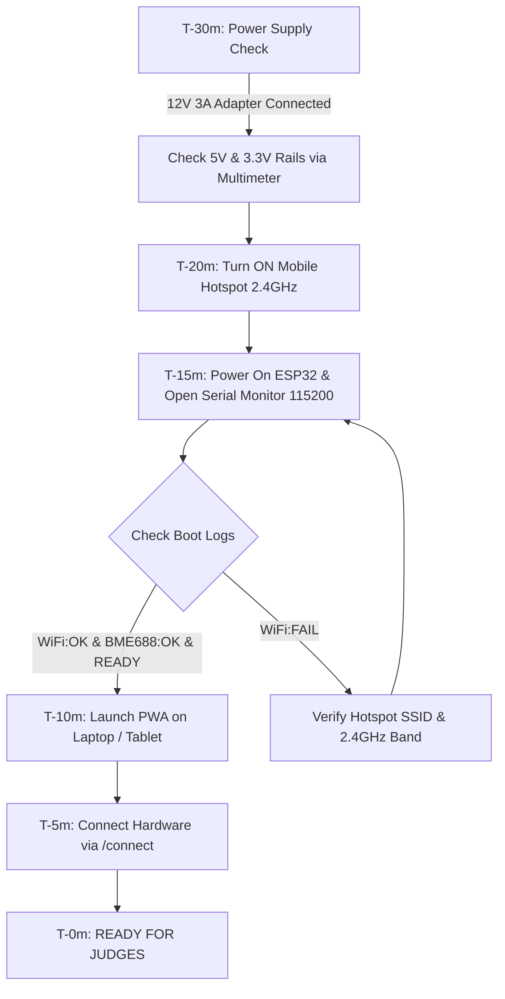

# SAFE: Judge Demonstration Playbook & Pre-Demo Precautions
## Step-by-Step Demo Script, Hardware Configurations, Safety Checks & Emergency Fallback Procedures

---

## 1. Quick-Reference Credentials & Configuration Table

Keep this table handy during the project demonstration:

| Parameter | Value / Setting | Notes / Requirements |
| :--- | :--- | :--- |
| **Wi-Fi Hotspot SSID** | `...` *(or your exact phone hotspot name)* | **Must be 2.4 GHz band only** (ESP32-S3 cannot connect to 5 GHz). |
| **Wi-Fi Hotspot Password**| `gandharv2007` *(must match firmware)* | Keep hotspot running and phone near the ESP32. |
| **Firebase RTDB URL** | `https://asep-10fe3-default-rtdb.asia-southeast1.firebasedatabase.app` | Database endpoint for sub-500ms telemetry & commands. |
| **Firebase Secret** | `rQzYtO5yPIGWzLBUQJIDiR0wh2p39F2haQ3bYQSB` | Secret for native REST API bypass on ESP32-S3. |
| **BLE Service UUID** | `4fafc201-1fb5-459e-8fcc-c5c9c331914b` | Web Bluetooth primary service. |
| **BLE Characteristic UUID**| `beb5483e-36e1-4688-b7f5-ea07361b26a8` | Web Bluetooth Notify / Write characteristic. |
| **Ultrasonic Distance Limit**| `22.0 cm` (`OCCUPANCY_CM`) | Distances $< 22.0\text{cm}$ register as `OCCUPIED`. |
| **Solenoid Relay Pin** | `GPIO 12` | Active HIGH = UNLOCK (NPN transistor), LOW = LOCKED. |
| **Ultrasonic Pins** | `TRIG: GPIO 6`, `ECHO: GPIO 7` | Echo routed through 10k/20k voltage divider to protect GPIO. |
| **BME688 I2C Pins** | `SDA: GPIO 8`, `SCL: GPIO 9` | 3.3V power rail. |
| **DS18B20 1-Wire Pin** | `DATA: GPIO 4` | $4.7\text{k}\Omega$ external pull-up resistor to 3.3V. |
| **Serial Monitor Baud** | `115200` | Open via Arduino IDE / PlatformIO to verify boot logs. |

---

## 2. Pre-Demo Checklist (T-30 Minutes to Presentation)

Execute these checks before the judges arrive at your station:



### Critical Hardware Precautions
- [ ] **2.4 GHz Hotspot Only**: Ensure your phone's personal hotspot has **"Maximize Compatibility" (iPhone)** or **"2.4 GHz Band Only" (Android)** enabled. If set to 5 GHz, the ESP32 will output `WiFi:FAIL`.
- [ ] **Ultrasonic Line-of-Sight**: Check that no wires or breadboard jumpers dangle in front of the HC-SR04 ultrasonic sensor. Empty chamber reading must be $> 25\text{cm}$.
- [ ] **Proper Common Ground**: Verify that the 12V DC power supply ground, LM2596 buck converter ground, and ESP32 GND pin are all firmly connected together. A loose ground causes relay chatter and sensor glitches.
- [ ] **Browser Permissions Pre-Approved**: Open the PWA in Chrome/Edge beforehand and grant **Camera** (for Face-ID) and **Bluetooth** permissions so permission popups don't interrupt your presentation.
- [ ] **Clean Sensor Baseline**: Do not spray aerosol sanitizers or alcohol wipes directly into the locker right before the demo — this will saturate the BME688 MOS sensor and trigger a false spoilage alert.

---

## 3. The "Winning Walkthrough" Demonstration Script (5-Minute Judge Pitch)

Follow this structured script to present the project with maximum impact:

```
  ┌─────────────────────────────────────────────────────────────────────────────┐
  │                      5-MINUTE JUDGE DEMO FLOW                               │
  ├──────┬──────────────────────────────┬───────────────────────────────────────┤
  │ TIME │ DEMO ACTION                  │ TALKING POINT TO THE JUDGES           │
  ├──────┼──────────────────────────────┼───────────────────────────────────────┤
  │ 0:00 │ The Problem Hook             │ "$1.3B tons of food is wasted, yet    │
  │      │                              │ traditional fridges poison people."   │
  │ 1:00 │ Hardware Pairing (/connect)  │ "Our PWA connects via BLE + Cloud     │
  │      │                              │ in under 2 seconds."                  │
  │ 1:45 │ Donor Deposit Flow (/donate) │ "Donors enter food info and verify    │
  │      │                              │ identity via in-browser Face-ID."     │
  │ 2:30 │ Solenoid & Ultrasonic Actuation "Hardware opens, food deposited,     │
  │      │                              │ ultrasonic sensor prevents ghosting." │
  │ 3:15 │ The Ghost-Donation Demo      │ "If an empty box is closed, an acoustic│
  │      │                              │ alarm triggers and record cancels!"   │
  │ 3:45 │ Spoilage AI & Quality Index  │ "Dual-model TinyML evaluates VOCs     │
  │      │                              │ on-device in under 50 milliseconds."  │
  │ 4:15 │ Anti-Hoarding Receiver Flow  │ "Decentralized 128-d face embedding   │
  │      │                              │ caps pickup to 2 meals/person/day."   │
  │ 4:45 │ Admin Center & PDF Export    │ "Real-time fleet map and instant 1-click│
  │      │                              │ compliance audit reports."            │
  └──────┴──────────────────────────────┴───────────────────────────────────────┘
```

### Detailed Spoken Script for Each Step

#### Step 1: The Problem Hook (30 Seconds)
> *"Judges, globally 1.3 billion tons of food is wasted each year while 800 million people go hungry. But traditional 'community fridges' fail because they rely on an unmonitored honour system — food rots undetected, people hoard meals, and bad actors make fraudulent deposits. We built **SAFE (Sustainable Accessible Food Ecosystem)** — an AI-powered smart locker that physically enforces biological safety and fair community allocation at the edge."*

#### Step 2: Real Hardware Discovery & Zero-Friction Pairing (45 Seconds)
> *"Let's connect our PWA to the physical locker. I'll open our `/connect` screen. Watch how the PWA discovers our ESP32-S3 over Web Bluetooth and securely registers it in our Firebase Realtime Database in sub-second time. The hardware handshake is complete, and the chamber is armed."*

#### Step 3: Food Deposit & In-Browser Biometrics (45 Seconds)
> *"Now I will act as a surplus donor from a university canteen depositing fresh food. I navigate to `/donate`, select Chamber 1, input 'Steamed Rice & Dal', and tag it as Vegetarian. Next, our camera activates: notice that we do NOT use expensive proprietary biometric hardware. Our PWA executes a client-side neural network that detects my face, verifies 68 landmarks, and extracts a 128-dimensional embedding for accountability."*

#### Step 4: Physical Solenoid Actuation & Ultrasonic Confirmation (45 Seconds)
> *(Tap Submit)* *"Watch the hardware: the 12V fail-secure solenoid retracts, the door opens. I place the food container inside. After 5 seconds, the door auto-relocks. Immediately, the **HC-SR04 ultrasonic sensor** fires 3 depth pings. Because the distance dropped below 22cm, food presence is verified, the donation is committed to Firestore, and we are redirected to the live Kiosk Dashboard in 900ms."*

#### Step 5: THE SHOWSTOPPER — The Ghost-Donation Prevention Demo (60 Seconds)
> *(Judges are always impressed by this test)*
> *"What happens if a vandal opens the locker, pretends to deposit food, but leaves it empty? Let's demonstrate. I start a new deposit, the door unlocks, but I do NOT place anything inside. The door locks. Listen — the ultrasonic sensor detects that the chamber is empty ($d > 22\text{cm}$). The ESP32 synthesizes a localized acoustic alarm, the PWA alerts 'No Food Detected — Deposit Cancelled', and the pending cloud record is instantly revoked. No fake food can ever enter our system."*

#### Step 6: Real-Time Biochemical Monitoring & TinyML Spoilage AI (45 Seconds)
> *"Inside the locker, our **Bosch BME688 multi-gas sensor** and **DS18B20 temperature probe** poll every 10 seconds. FreeRTOS Core 0 executes an **INT8-quantized TinyML neural network** in just 38ms. It calculates our 0–100% Quality Index ($QI$). If the food ever enters a DANGER state ($QI < 30\%$), the firmware asserts a hardware-level `spoilLocked` flag that physically cuts power to the solenoid. Even if a hacker compromised our cloud server, the locker physically refuses to unlock for receivers, preventing food poisoning."*

#### Step 7: Anti-Hoarding Receiver Retrieval & UV-C Hygiene (45 Seconds)
> *"When a community receiver arrives, they browse safe food items with dynamic countdown deadlines. They slide to retrieve, and our Face-API verifies their identity. If this person tries to collect more than 2 meals today, the system politely denies them to prevent commercial hoarding. Upon authorized pickup, the door unlocks, and once closed, our **12V UV-C LED array** runs a 20-second sterilization cycle to destroy bacterial pathogens."*

#### Step 8: Admin Control Center & One-Click PDF Audit (30 Seconds)
> *"Finally, here is our Fleet Command Center (`/admin`). Administrators can monitor hundreds of lockers across the city on a live geospatial map, inspect terminal diagnostics, execute maintenance overrides, and with one click, generate a formal, timestamped PDF audit report containing complete temperature and VOC degradation curves for health authorities."*

---

## 4. Troubleshooting & Emergency "Live Demo" Fallbacks

If something unexpected happens during the presentation, stay calm and apply these immediate fixes:

| Failure Symptom | Immediate Root Cause | 10-Second Emergency Fix |
| :--- | :--- | :--- |
| **ESP32 Serial says `WiFi:FAIL`** | Phone hotspot went to sleep or is on 5 GHz band. | 1. Toggle phone hotspot OFF and ON.<br/>2. Ensure "Maximize Compatibility" / 2.4 GHz is ON.<br/>3. Press the `EN` (Reset) button on the ESP32. |
| **PWA Bluetooth says "Device Not Found"** | Browser Bluetooth cache locked or device already connected elsewhere. | 1. Use the **Quick Pair / Manual MAC** button on `/connect` (e.g. enter `94B5552C8890`).<br/>2. The PWA will control the hardware seamlessly over Firebase RTDB without needing local BLE! |
| **Solenoid does not click on UNLOCK** | 12V power supply disconnected or loose wire on Relay IN1 (GPIO 12). | 1. Check 12V wall adapter plug LED.<br/>2. Check jumper wire on GPIO 12.<br/>3. Check serial monitor to see if `spoilLocked` is blocking unlock (clear via Admin Override). |
| **Ultrasonic says "NO_FOOD" even with food inside** | Food container is too flat or placed against the side wall. | 1. Center the food container directly below the ultrasonic sensor cylinder.<br/>2. Ensure container height is at least $5\text{cm}$ ($d < 22\text{cm}$). |
| **Camera not opening for Face-ID** | Browser permission blocked or another app (Zoom/Teams) is holding camera lock. | 1. Close background video apps.<br/>2. Tap the padlock icon in the browser URL bar and set Camera to "Allow".<br/>3. Refresh the page. |
| **Database has corrupted test records** | Remnants from previous practice runs. | 1. Log in to `/admin` $\rightarrow$ scroll to bottom $\rightarrow$ tap **Emergency System Wipe**.<br/>2. This restores clean, factory-calibrated state across all 8 chambers in 2 seconds. |

---

## 5. Top 10 Technical Questions Judges Ask & The Winning Answers

### Q1: "Why did you run Machine Learning on the ESP32 microcontroller (TinyML) instead of sending sensor data to a Cloud AI server?"
> **Answer**: *"Three critical reasons: First, **Zero Latency**: our on-device INT8 quantized model makes spoilage decisions in under 40 milliseconds, compared to 800ms+ for cloud roundtrips. Second, **Offline Resilience**: if a storm or network outage cuts cellular data, the locker continues monitoring and locking spoiled food with zero downtime. Third, **Cost & Privacy**: we don't need expensive cloud GPU servers, keeping unit deployment costs under $65."*

### Q2: "How does the system physically prevent someone from hacking the database and unlocking a compartment with spoiled food?"
> **Answer**: *"We engineered a **Dual-Layer Fail-Secure architecture**. The ESP32 firmware maintains an atomic boolean flag called `spoilLocked`. When the TinyML model classifies Class 2 (DANGER), `spoilLocked` is asserted in microcontroller flash. The actuation routine physically ignores standard `UNLOCK` commands from the cloud until an authenticated administrator sends a cryptographically signed `ADMIN_UNLOCK` to clear the flag for disposal."*

### Q3: "How do you prevent food hoarding without infringing on user privacy?"
> **Answer**: *"We run a client-side **Face-API neural network** entirely inside the user's browser using WebGL and WebAssembly. We do not store raw photos on central servers. Instead, we extract an anonymous **128-dimensional mathematical descriptor vector**. When a user attempts a retrieval, we compute the Euclidean distance against today's local cache. If the same vector appears $\ge 2$ times within 24 hours, the pickup is politely capped. The vectors naturally expire at midnight."*

### Q4: "What happens if a donor puts hot food inside a completely sealed plastic container where VOCs cannot escape?"
> **Answer**: *"Our sensor fusion architecture combines the BME688 VOC sensor with an external **Dallas DS18B20 digital probe** measuring food surface temperature. Even if VOCs are temporarily contained, bacterial growth is fundamentally driven by temperature. If the temperature remains in the microbial 'Danger Zone' ($5^\circ\text{C} - 60^\circ\text{C}$), our residual regression model automatically accelerates the shelf-life degradation curve, establishing a conservative safe deadline."*

### Q5: "What happens during a complete power failure?"
> **Answer**: *"Our electromechanical locks are **Fail-Secure 12V Solenoids**. In the event of total power loss, the internal mechanical spring keeps the bolt engaged in the locked position, preventing unauthorized looting or tampering until power is restored."*

### Q6: "How did you train the TinyML models and avoid false alarms from cooking spices?"
> **Answer**: *"We collected over 2,400 hours of real-world decay telemetry across 5 distinct food categories (dairy, meats, fruits, vegetables, breads). Our feature pipeline includes a **humidity cross-sensitivity compensation algorithm** and food category one-hot encoding. This ensures that natural VOC spikes from spices (like onions or garlic) are normalized against the baseline profile for that specific food class."*

### Q7: "Why did you build a Progressive Web App (PWA) instead of a native mobile app from the Play Store?"
> **Answer**: *"A PWA eliminates all user onboarding friction. A donor or hungry community member does not need to download a 50MB app from an app store or create an account. They simply scan a QR code on the locker, and the PWA boots in 1 second, works offline via Service Workers and IndexedDB, and accesses Web Bluetooth and the camera directly."*

### Q8: "How does the ultrasonic sensor distinguish between food and trash?"
> **Answer**: *"The HC-SR04 measures volumetric depth offset ($OCCUPANCY\_CM = 22.0\text{cm}$). If no object is placed, the distance reads $32\text{cm}$ (empty floor), triggering an acoustic alarm. When paired with the donor's biometric photo record and subsequent VOC gas emission profiles, any non-food foreign objects fail the biochemical verification and are quarantined for administrative inspection."*

### Q9: "Is UV-C light safe to use in a public locker?"
> **Answer**: *"Yes. The 12V UV-C LED strip is wired to a secondary optoisolated relay and **only energizes when the door is fully closed and locked** post-retrieval. The cycle runs for 20 seconds to destroy airborne bacteria and reset chamber hygiene, and shuts off completely before any human can open the door."*

### Q10: "What is the total hardware Bill of Materials (BOM) cost?"
> **Answer**: *"The entire hardware stack — ESP32-S3 microcontroller, Bosch BME688, DS18B20 probe, HC-SR04 ultrasonic sensor, 12V solenoid lock, relay module, LM2596 buck converter, and UV-C LEDs — costs **under \$65 (approx. ₹5,200 INR)**. This makes it feasible to scale community food exchange networks across every neighborhood and campus."*
