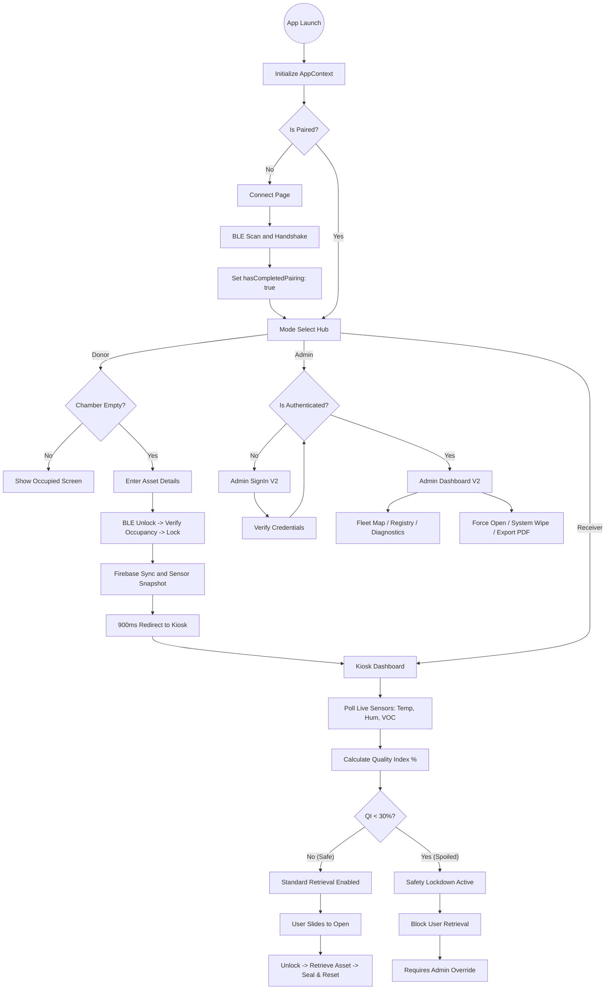

# SAFE Frontend Architecture & Operational Flow (v2.0)

This document provides a comprehensive, technical deep-dive into the micro-steps, operational logic, and architectural engines of the SAFE (Sustainable Accessible Food Ecosystem) PWA. It is designed to be a definitive reference for developers and system auditors.

---

## 1. High-Level Architecture Overview

The SAFE PWA is built on a **Modular Engine Architecture**, where specific functional domains are encapsulated into "Engines" that interact via a centralized global state (`AppContext`) and a hardware abstraction layer (`useLockerController`).

### Core Architectural Pillars:
*   **State Management**: React Context + Reducer (`AppContext`) handles pairing status, authentication, locker telemetry, and system logs.
*   **Hardware Abstraction**: `useLockerController` hook provides a high-level API for all hardware interactions (BLE) and data persistence (Firebase/IndexedDB).
*   **Safety Layer**: `Intelligence Engine` performs real-time sensor fusion to enforce biological safety standards.
*   **Visual System**: "Cyber-Botanical" aesthetic implemented via high-density CSS and `framer-motion` for micro-animations.

---

## 2. The Four Operational Engines

### A. The Guard Engine (Identity & Connectivity)
Responsible for device onboarding and route security.
*   **Pairing Flow**: Upon launch, the `AppShell` queries `localStorage` for a pairing token.
*   **BLE Discovery**: If unpaired, the user is gated at `/connect`. The system initiates a Web Bluetooth scan for the `ec0-0001` service.
*   **Security Handshake**: Establishes a secure link with the ESP32-S3 hardware. Once paired, the `hasCompletedPairing` flag is set to `true`, unlocking the rest of the application.

### B. The Input Engine (Donor Registration)
Manages the lifecycle of a food donation.
1.  **Chamber Validation**: Checks `occupancyState`. Only "empty" chambers can accept new assets.
2.  **Asset Cataloging**: Collects Food Name, Category, and Dietary Tags (Veg, Vegan, Non-Veg).
3.  **Hardware Command Chain**:
    *   `sendCategory`: Writes asset metadata to the hardware via BLE.
    *   `unlock`: Issues a solenoid release command.
    *   `lock`: Confirms the door is sealed after deposit.
    *   `verifyOccupancy`: Confirms food presence via ultrasonic sensing and seals chamber.
4.  **Cloud Sync**: Simultaneously registers the donation in the Firebase Realtime Database and enqueues sensor snapshots for historical tracking.

### C. The Intelligence Engine (Quality Guard & Kiosk)
The "Brain" of the unit, monitoring asset health in real-time.
1.  **Sensor Fusion**: Continuously polls Temp (°C), Humidity (%), and VOC Gas Resistance (Ω).
2.  **Quality Index (QI) Algorithm**:
    *   Normalizes the estimated shelf life (default 48hrs) against real-time sensor data.
    *   **QI % = (Hours Remaining / Max Shelf Life) * 100**.
3.  **Automated Lockdown logic**:
    *   **Optimal State (QI >= 30%)**: Standard retrieval is enabled via the `SlideConfirm` component.
    *   **Quarantine State (QI < 30%)**: The system enters **Safety Lockdown**. Standard retrieval is programmatically disabled. The compartment is marked as "Restricted" to prevent the distribution of spoiled food.

### D. The Command Engine (Administrative Oversight)
The fleet management interface (`AdminPageV2`).
*   **Fleet Map**: Geospatial visualization of all active SAFE units and their health status.
*   **Strategic Asset Registry**: A centralized log of all active donations, donor contact info, and current quality scores.
*   **Terminal Diagnostics**: Deep inspection of the currently selected locker's sensor health and TinyML engine state.
*   **Administrative Overrides**:
    *   **Force Open**: Bypasses the Quality Guard (QI < 30%) for maintenance or cleaning. Requires a separate Admin Auth handshake.
    *   **System Actions**: Force Sync, BLE Reset, and Emergency System Wipe.

### E. The Verification Engine (Mobile QR & Client-IP Guard)
Contactless donor onboarding via phone camera and cellular authentication.
*   **Dynamic QR Tokens**: Kiosk creates a cryptographic session in Firestore (`qr_sessions`).
*   **Multi-Tier Client-IP**: Resolves edge IP through `/api/client-ip` and Cloudflare/Ipify traces for anti-spoofing and network consistency.
*   **Mobile Scan (`/qr-scan`)**: Donor scans the QR with their smartphone camera, enters their phone number, and receives an SMS OTP (Fast2SMS).
*   **Real-time Handshake**: Kiosk observes verification via Firestore snapshot and automatically unlocks the assigned chamber.

### F. The Guidance & Accessibility Engine (Website Tour & Voice Assistant)
Interactive assistance and hands-free vocal control.
*   **Dual-Track Guided Tour (`WebsiteTour.tsx`)**: Offers interactive walkthroughs for Donors and Receivers with spotlight element cutouts, route auto-transitions, and celebration modals.
*   **Neural Voice Assistant (`VoiceAssistant.tsx`)**: Web Speech recognition and multilingual synthesis (EN/HI/MR) with phonetic text normalization (`cleanTextForSpeech`) and hands-free query navigation.

---

## 3. Granular Micro-Step Flowchart

---

## 4. Technical Implementation Details

### A. State Management & Hooks
*   **`useLockerController`**: The primary interface for components. It manages the `isBusy` state during hardware operations and abstracts complex multi-step processes like `submitDeposit` and `retrieveFood`.
*   **`AppContext`**: Maintains the global registry of `lockers[]`. Each locker object contains its current `telemetry`, `occupancyState`, and `activeDonation`.

### B. Hardware Synchronization
*   **Bluetooth Services**: The app communicates with the ESP32-S3 via a custom service `ec0-0001`.
*   **Event Logging**: Every hardware action (Unlock, Lock, Cycle) creates a `LockerEvent` record which is cached locally and enqueued for cloud synchronization.

### C. Predictive Reporting
*   **Telemetry PDF Export**: The `generateTelemetryPDF` utility uses `jsPDF` to create high-fidelity audit reports. These reports include:
    *   **Freshness Analysis**: Calculated QI, risk levels, and AI-generated insights.
    *   **Community Impact**: Registry of active donations and donor metadata.
    *   **Diagnostic Logs**: Sensor module health and operational status.

---

## 5. Summary for Newbies

1.  **Always Pair First**: The app won't let you do anything until you connect to a SAFE unit via Bluetooth.
2.  **Donations are Tracked**: When you donate, the app tells the locker what it is, unlocks it, and then starts a cleaning cycle once you close it.
3.  **Safety is Automatic**: The dashboard calculates how fresh the food is. If it's too old (QI < 30%), it **locks down** automatically for your safety.
4.  **Admin is Boss**: Admins can see every donation in the fleet and can "Force Open" any locker if something goes wrong or needs cleaning.
5.  **Everything is Logged**: Every sensor reading and every door opening is synced to the cloud for a full audit trail.
