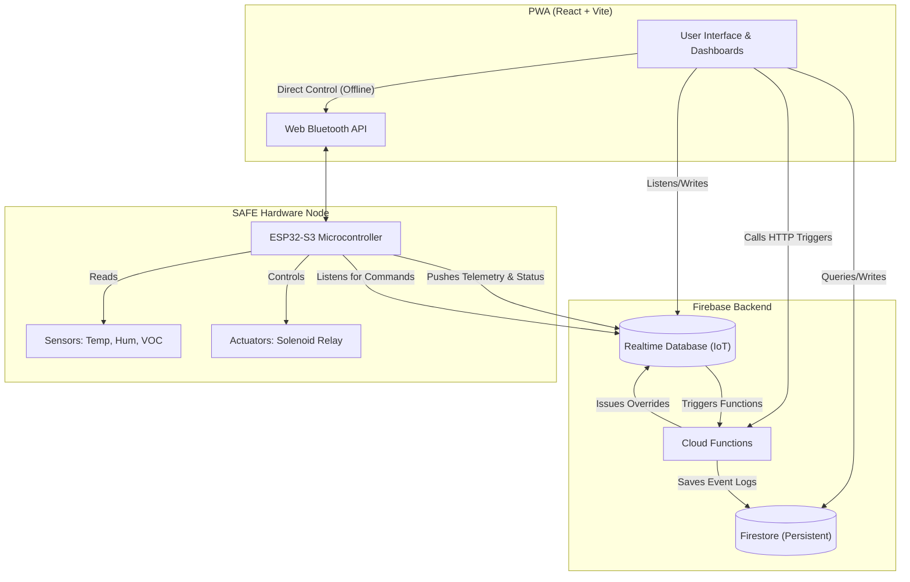
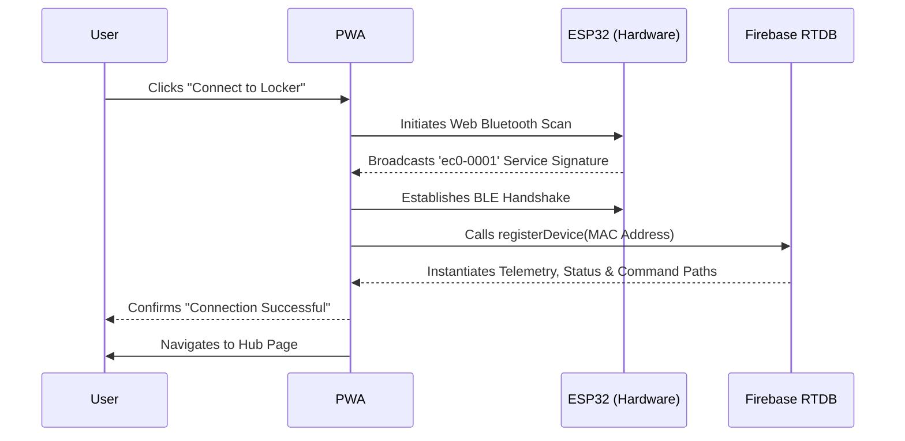
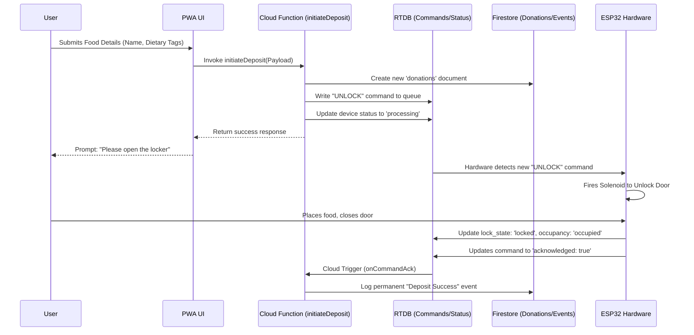
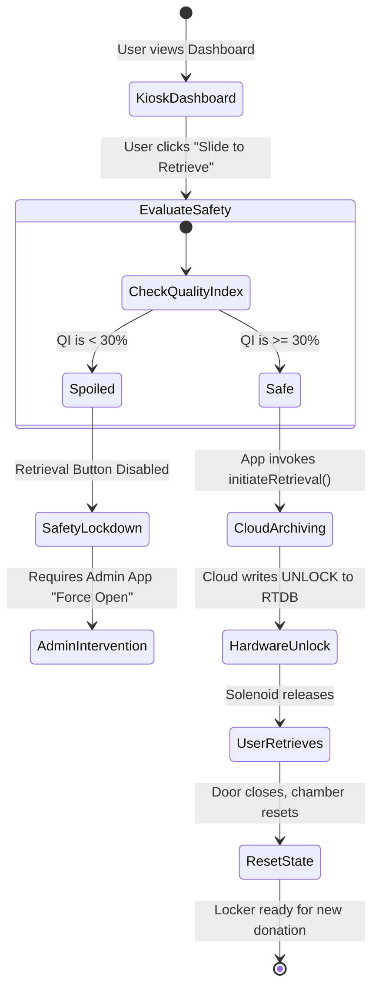
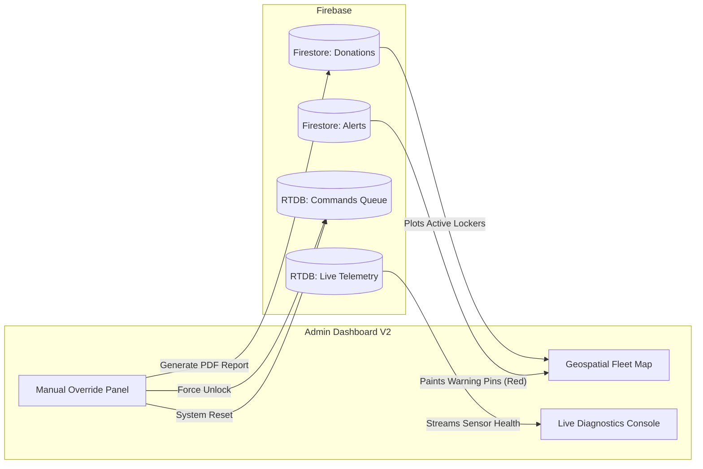

# SAFE Locker: Visual & Logic Guide

This document provides visual flowcharts, sequence diagrams, and architecture maps to help developers, designers, and stakeholders quickly understand the SAFE system's logic and structural data flow.

---

## 1. High-Level System Architecture

This graph illustrates how the React frontend, the split-database Firebase cloud, and the ESP32 hardware interact with each other.



---

## 2. Hardware Setup & Connectivity (The Guard Engine)

Before any operation, the PWA must establish a trusted local Bluetooth connection to the hardware and register it in the cloud.



---

## 3. The Donor Deposit Flow (Input Engine)

This sequence shows the path when a user donates food. It requires cloud orchestration followed by a physical hardware actuation loop.



---

## 4. Telemetry & Spoilage Logic (The Intelligence Engine)

This flowchart explains how real-time sensor data is translated into UI feedback and safety protocols.

```mermaid
graph TD
    Start((Power On)) --> ReadSensors[ESP32 Polls: Temp, Humidity, VOC]
    ReadSensors --> PushRTDB[ESP32 Pushes to RTDB 'telemetry']
    
    PushRTDB --> PWAListens[PWA Updates UI Dashboards]
    PushRTDB --> CloudTrigger[Cloud Trigger: onTelemetryWrite]
    
    %% PWA Side Logic
    PWAListens --> CalcQI[PWA Recalculates Quality Index %]
    CalcQI --> UpdateGauges[Chart.js Gauges Animate]
    
    %% Cloud Side Logic
    CloudTrigger --> CheckSpoilage{"Are sensors beyond safe limits? (e.g. Temp > 8°C)"}
    
    CheckSpoilage -- Yes --> AlertCreated[Create 'alert' document in Firestore]
    AlertCreated --> IsCritical{"Is it a Critical Spoilage Risk?"}
    
    IsCritical -- Yes --> Quarantine[Write "LOCK" command to RTDB]
    Quarantine --> UIUpdate["UI forces Safety Lockdown / Restricted state"]
    IsCritical -- No --> Warning[Log warning, continue standard operations]
    
    CheckSpoilage -- No --> SaveSnapshot[Periodic: Save snapshot to Firestore for analysis]
```

---

## 5. Receiver Retrieval Flow

This state diagram illustrates the logic branches when a receiver approaches to take food.



---

## 6. Admin Control & Fleet Ops (Command Engine)

The high-level data flow for the Administrative map and controls.


