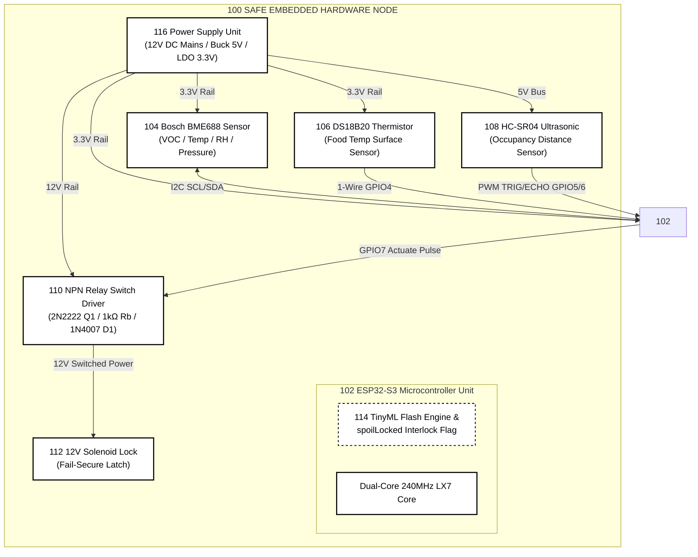
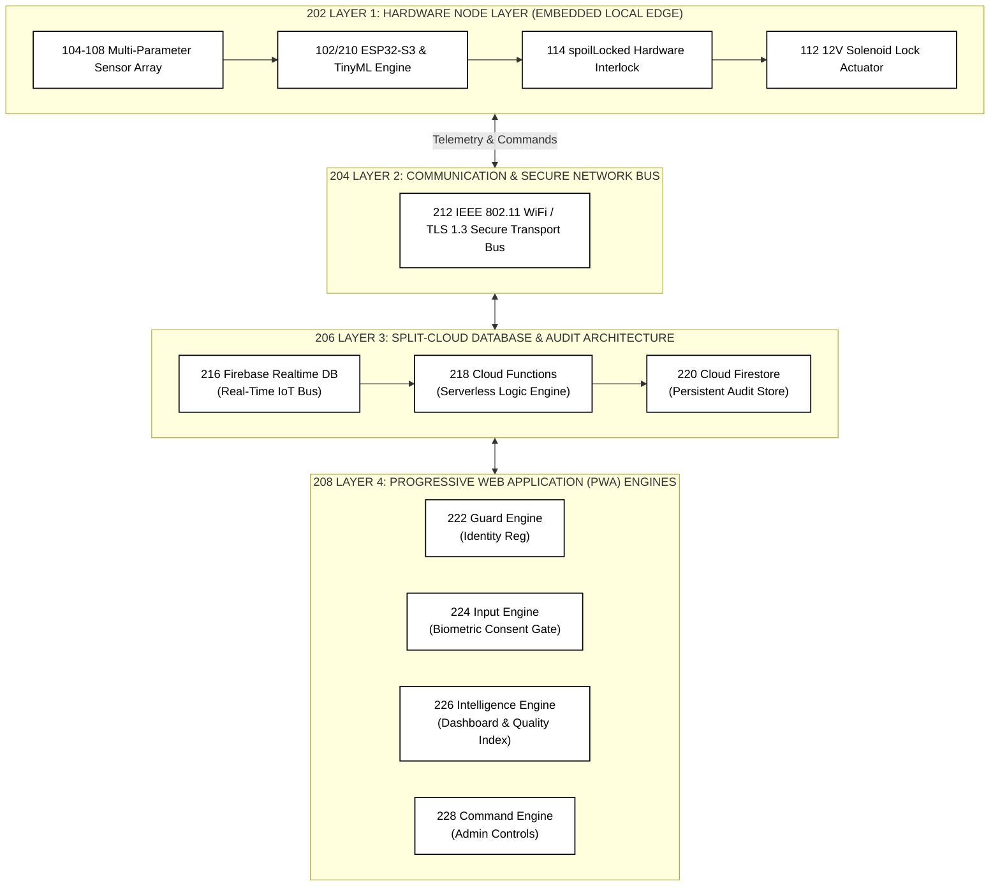

# SAFE (Smart Automated Food Exchange) - Patent Drawings & Gemini Prompts Package

> [!IMPORTANT]
> **Patent Office Drawing Standard Notice:**
> Patent offices (USPTO, Indian Patent Office, EPO, PCT) strictly reject generic colored flowcharts or gray block diagrams. Patent drawings **MUST** be **black-and-white vector line art** featuring explicit **numerical reference callouts** (e.g., `100`, `102`, `104`) that match the claims and detailed description text of your patent specification.

---

## 1. High-Precision Gemini Prompts for Image Generation

Use the following prompts directly in **Gemini**, **Imagen 3**, or **Midjourney v6** to generate official, clean, monochrome CAD-style line art patent drawings.

### 📋 Prompt 1: Hardware Circuit & Actuation Schematic (FIG. 1)

```text
Generate a formal USPTO patent drawing schematic in pure black and white line art (monochrome, white background, crisp clean black lines, no color, no gray shading). 

Title: "FIG. 1 - HARDWARE CIRCUIT AND EMBEDDED ACTUATION SCHEMATIC"

The schematic must represent an electronics block diagram enclosed in a dashed system box labeled '100'.
Components to draw as rectangular block symbols with clean black line borders and bold numerical reference numerals:
1. '116' POWER SUPPLY UNIT: connected to 12V DC input, showing internal buck converter to 5V and LDO to 3.3V.
2. '102' ESP32-S3 MICROCONTROLLER UNIT: central rectangular IC box with pin labels: 3V3, GND, GPIO8 (SCL), GPIO9 (SDA), GPIO4 (1-WIRE), GPIO5 (TRIG), GPIO6 (ECHO), GPIO7 (ACTUATE). Inside 102, show a dashed memory block labeled '114' (TINYML INT8 FLASH ENGINE & spoilLocked INTERLOCK FLAG).
3. '104' BOSCH BME688 SENSOR: showing 4-wire I2C bus connected to GPIO8 and GPIO9 of 102.
4. '106' DS18B20 THERMISTOR: showing 1-Wire bus with pull-up resistor connected to GPIO4 of 102.
5. '108' HC-SR04 ULTRASONIC SENSOR: showing TRIG and ECHO lines connected to GPIO5 and GPIO6 of 102.
6. '110' NPN RELAY SWITCH CIRCUIT: containing 2N2222 NPN transistor Q1, 1k ohm base resistor Rb, 1N4007 flyback diode D1, and 5V/12V relay coil, receiving control signal from GPIO7 of 102.
7. '112' 12V SOLENOID LOCK: electromechanical fail-secure actuator connected to switched 12V output of relay 110.

Style: Technical CAD electronic schematic layout, white background, black ink lines, crisp text, reference numerals placed outside component boxes with leader lines.
```

---

### 📋 Prompt 2: Four-Layer System Architecture Diagram (FIG. 2)

```text
Generate a clean, formal patent architecture diagram in black and white monochrome CAD style (white background, thin black vector lines, bold text labels, no colors or gradients).

Title: "FIG. 2 - FOUR-LAYER SYSTEM ARCHITECTURE"

Show four horizontal rectangular layer containers stacked vertically inside a main system frame labeled '200', separated by dashed lines and connected with solid black vertical arrows:

Layer 1 (Top) - '202' HARDWARE NODE LAYER (EMBEDDED EDGE):
Contains four rectangular sub-blocks: Sensor Array '104-108', ESP32-S3 MCU with TinyML Flash Engine '102/210', Firmware spoilLocked Interlock Flag '114', and 12V Solenoid Lock Actuator '112'.

Layer 2 - '204' COMMUNICATION & SECURE NETWORK BUS:
Contains central block '212' labeled 'IEEE 802.11 WiFi & TLS 1.3 Transport Layer (Asynchronous MQTT/WebSockets)'.

Layer 3 - '206' SPLIT-CLOUD DATABASE & AUDIT ARCHITECTURE:
Contains three connected blocks: '216' Firebase Realtime DB (Real-Time IoT Bus), '218' Cloud Functions (Serverless Logic Engine), and '220' Cloud Firestore (Persistent Audit Store).

Layer 4 (Bottom) - '208' PROGRESSIVE WEB APPLICATION (PWA) ENGINES:
Contains four sub-blocks: '222' Guard Engine (Identity & Device Reg), '224' Input Engine (Biometric Consent Gate), '226' Intelligence Engine (Dashboard & Quality Index), and '228' Command Engine (Admin & Override Controls).

Style: Formal Engineering Patent Block Diagram, monochrome line art, reference numerals with arrows pointing to each block.
```

---

### 📋 Prompt 3: TinyML Preprocessing & Inference Pipeline (FIG. 3)

```text
Generate a formal patent flowchart and processing block diagram in clean monochrome black and white CAD line art.

Title: "FIG. 3 - TINYML PREPROCESSING AND DUAL-MODEL INFERENCE PIPELINE"

Draw a vertical process pipeline labeled '300' consisting of sequential rectangular blocks connected by centered black down-arrows:
1. Block '302': RAW SENSOR DATA INGESTION (Temp, RH, VOC Gas Resistance, Barometric Pressure, Food Surface Temp).
2. Block '304': RANGE VALIDATION & OUTLIER FILTERING.
3. Block '306' (Highlighted Formula Box): HUMIDITY CROSS-SENSITIVITY COMPENSATION ALGORITHM [Equation: G_comp = G_raw / (1 - 0.02 * (RH - 55))].
4. Block '308': FEATURE ENGINEERING PROCESSOR (10-Feature Vector Extraction & Temp Delta).
5. Block '310': STANDARD SCALER NORMALIZATION [Z = (X - mu) / sigma].
6. Block '312': DUAL-MODEL INT8 QUANTIZED TINEML TFLITE MICRO INFERENCE ENGINE (<50ms latency).
7. Parallel Output Split:
   - Left Branch -> Block '314': MLP FOOD SAFETY CLASSIFIER (Output Class 0: SAFE, 1: CAUTION, 2: DANGER).
   - Right Branch -> Block '316': RESIDUAL MLP SHELF-LIFE REGRESSOR (Output Continuous Days Remaining).
8. Decision Diamond '318': 'CLASSIFICATION == 2? (DANGER)'
   - YES Arrow -> Block '320': ASSERT FIRMWARE spoilLocked FLAG (Physical Solenoid Lockout).
   - NO Arrow -> Block '322': ALLOW PWA UNLOCK ACTUATION.

Style: Pure black line drawing, white background, no fill colors, reference callouts (300-322).
```

---

### 📋 Prompt 4: Biometric Consent Gate & Ghost-Donation Flowchart (FIG. 4)

```text
Generate an official patent flowchart in monochrome black and white line art (white background, thin black lines, crisp text).

Title: "FIG. 4 - BIOMETRIC CONSENT GATE AND GHOST-DONATION PREVENTION PROTOCOL"

Draw a process flow diagram starting from top node '402' USER INITIATES DEPOSIT VIA PWA:
1. Block '404': PWA ACCESSES DEVICE CAMERA (In-Browser Frame Buffer Stream).
2. Diamond '406': LIVENESS CONSISTENCY CHECK (4 of 5 Valid Neural Frames?).
   - FAIL -> Block '408': BLOCK DEPOSIT (Face Unrecognized / Spoof).
   - PASS -> Block '410': EXTRACT 128-D FACIAL EMBEDDING VECTOR.
3. Block '412': COMMIT IMMUTABLE IDENTITY RECORD TO CLOUD (Firestore Audit Store '220').
4. Block '414': TRIGGER SOLENOID UNLOCK PULSE (5 Seconds).
5. Block '416': HC-SR04 ULTRASONIC CHAMBER OCCUPANCY POLL.
6. Diamond '418': DISTANCE d < 34.0 cm? (Physical Item Present?).
   - YES -> Block '420': DEPOSIT CONFIRMED & TRACKED (Initiate Continuous Monitoring).
   - NO -> Block '422' (Dashed Anomaly Box): FORENSIC GHOST ATTEMPT HANDLER (Synthesize Acoustic Alarm, Cancel Cloud Record, Log Fraud Audit, Relock Solenoid Empty).

Style: Official patent flowchart style, clear arrow pathways, black and white only, numbered reference callouts.
```

---

## 2. Complete Patent Reference Numeral Key Table

This table maps every callout number across **FIG. 1**, **FIG. 2**, **FIG. 3**, and **FIG. 4** to your patent draft specification:

| Ref Numeral | Component / Process Name | Figure | Description / Function |
| :--- | :--- | :--- | :--- |
| **100** | System Enclosure | Fig. 1 | Physical hardware housing for SAFE locker node |
| **102** | ESP32-S3 Microcontroller Unit | Fig. 1, 2 | Dual-core 240MHz MCU executing TinyML & I/O |
| **104** | Bosch BME688 Sensor | Fig. 1, 2 | Gas resistance (VOC), ambient temp, RH, pressure |
| **106** | DS18B20 Thermistor | Fig. 1, 2 | Contact thermistor measuring food surface temp |
| **108** | HC-SR04 Ultrasonic Sensor | Fig. 1, 2 | Chamber occupancy distance sensor (<34cm) |
| **110** | NPN Relay Driver Circuit | Fig. 1 | 2N2222 Transistor Q1, 1kΩ Rb, 1N4007 Diode D1, Relay |
| **112** | Solenoid Lock Actuator | Fig. 1, 2 | 12V fail-secure electromechanical lock |
| **114** | `spoilLocked` Firmware Interlock | Fig. 1, 2, 3 | Hardware-enforced lock flag asserting physical lockdown |
| **116** | Power Supply Unit (PSU) | Fig. 1 | Mains 12V DC PSU with 5V buck & 3.3V LDO |
| **200** | System Architecture | Fig. 2 | Four-layer software & hardware ecosystem |
| **202** | Layer 1: Hardware Node Layer | Fig. 2 | Embedded sensor & edge actuation tier |
| **204** | Layer 2: Network Bus Layer | Fig. 2 | IEEE 802.11 WiFi & TLS 1.3 transport |
| **206** | Layer 3: Split-Cloud Database | Fig. 2 | Dual cloud store (Realtime DB + Firestore) |
| **208** | Layer 4: Progressive Web App | Fig. 2 | Local-first PWA operational engine layer |
| **210** | TinyML Flash Engine | Fig. 2, 3 | Quantized INT8 dual-model TFLite binary |
| **212** | Secure Transport Bus | Fig. 2 | Encrypted WebSockets / MQTT interface |
| **216** | Firebase Realtime DB | Fig. 2 | Real-time IoT state sync & actuation bus |
| **218** | Cloud Functions Engine | Fig. 2 | Serverless anti-hoarding & revocation rules |
| **220** | Cloud Firestore Audit Store | Fig. 2, 4 | Persistent store for 128-D biometric hashes |
| **222** | PWA Guard Engine | Fig. 2 | Identity verification & device registration |
| **224** | PWA Input Engine | Fig. 2, 4 | Biometric Consent Gate & landmark NN |
| **226** | PWA Intelligence Engine | Fig. 2 | Dashboard, Quality Index (QI), & shelf-life |
| **228** | PWA Command Engine | Fig. 2 | Admin override & `ADMIN_UNLOCK` controls |
| **300** | Machine Learning Pipeline | Fig. 3 | End-to-end edge AI preprocessing & inference |
| **302** | Raw Sensor Ingestion Node | Fig. 3 | Ingestion of raw gas resistance, RH, temp |
| **304** | Outlier Filter Module | Fig. 3 | Range validation & noise suppression |
| **306** | Humidity Compensation Algorithm | Fig. 3 | \(G_{comp} = G_{raw} / (1 - 0.02 \times (RH - 55))\) |
| **308** | Feature Engineering Module | Fig. 3 | 10-feature vector & temp delta extraction |
| **310** | StandardScaler Normalizer | Fig. 3 | Zero-mean unit-variance normalization |
| **312** | Dual-Model Inference Engine | Fig. 3 | Parallel TFLite Micro execution (<50ms) |
| **314** | MLP Food Safety Classifier | Fig. 3 | 3-class output (0: SAFE, 1: CAUTION, 2: DANGER) |
| **316** | Residual MLP Regressor | Fig. 3 | Continuous shelf-life prediction in days |
| **318** | Spoilage Comparator | Fig. 3 | Decision node evaluating if Class == 2 |
| **320** | Assert `spoilLocked` Module | Fig. 3 | Hardware lockout assertion block |
| **322** | Allow Actuation Module | Fig. 3 | Software unlock permission node |
| **400** | Biometric Consent & Ghost Protocol | Fig. 4 | Flowchart for user deposit & fraud check |
| **402** | User Deposit Ingestion | Fig. 4 | Deposit start event on PWA |
| **404** | Camera Frame Buffer Node | Fig. 4 | Live in-browser camera stream |
| **406** | Neural Liveness Check Node | Fig. 4 | Decision node evaluating 4/5 landmark frames |
| **408** | Block Deposit Handler | Fig. 4 | Rejection for spoofed/unrecognized face |
| **410** | Facial Embedding Generator | Fig. 4 | Extraction of 128-dimensional vector |
| **412** | Cloud Identity Commit Node | Fig. 4 | Non-repudiable audit logging to Firestore |
| **414** | Solenoid Pulse Trigger Node | Fig. 4 | 5-second 12V relay actuation pulse |
| **416** | Ultrasonic Poll Node | Fig. 4 | Chamber distance sensing via HC-SR04 |
| **418** | Chamber Occupancy Evaluator | Fig. 4 | Decision node evaluating if distance < 34cm |
| **420** | Confirmed Deposit Commit Node | Fig. 4 | Deposit verification & monitoring start |
| **422** | Forensic Ghost Attempt Handler | Fig. 4 | Alarm trigger, cloud record revocation & log |

---

## 3. Ready-to-Use Generated Vector Files & 300 DPI Images

We have generated **standalone CAD-grade SVG drawings**, **300 DPI high-resolution PNG images**, and **vector PDFs** directly in your conversation workspace:

- 📄 **Figure 1 (Circuit Schematic)**: [figures/patent_figure_1_circuit_diagram.svg](figures/patent_figure_1_circuit_diagram.svg) | [PNG File](figures/patent_figure_1_circuit_diagram.png) | [PDF File](figures/patent_figure_1_circuit_diagram.pdf)
- 📄 **Figure 2 (System Architecture)**: [figures/patent_figure_2_system_architecture.svg](figures/patent_figure_2_system_architecture.svg) | [PNG File](figures/patent_figure_2_system_architecture.png) | [PDF File](figures/patent_figure_2_system_architecture.pdf)
- 📄 **Figure 3 (TinyML Pipeline)**: [figures/patent_figure_3_tinyml_pipeline.svg](figures/patent_figure_3_tinyml_pipeline.svg)
- 📄 **Figure 4 (Biometric Flowchart)**: [figures/patent_figure_4_biometric_ghost_flowchart.svg](figures/patent_figure_4_biometric_ghost_flowchart.svg)

---

## 4. Mermaid Code Diagrams for Draw.io & Markdown

If you prefer to edit or render diagrams directly in **Draw.io**, **Mermaid Live Editor**, or GitHub markdown:

### FIG. 1: Electronics Circuit Schematic (Mermaid)



### FIG. 2: System Architecture (Mermaid)


